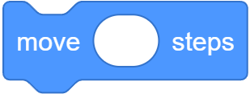

# Lecture 0
{:.no_toc}

* TOC
{:toc}

## Welcome

* Computer science is less about programming than about problem solving. And though there may be frustration from feeling stuck or making mistakes, there will also be a great sense of gratification and pride from getting something to work or completing some task.

* Importantly,
    > what ultimately matters in this course is not so much where you end up relative to your classmates but where you end up relative to yourself when you began

## What is computer science?

* Computer science is fundamentally problem solving, but we’ll need to be precise and methodical.
* We can think of **problem solving** as the process of taking some input (a problem we want to solve) and generate some output (the solution to our problem).

    

* To begin doing that, we’ll need a way to represent inputs and outputs, so we can store and work with information in a standardized way.

## Representing numbers

* To count the number of people in a room, we might start by using our fingers, one at a time. This system is called **unary**, where each digit represents a single value of one.
* To count to higher numbers, we might use ten digits, 0 through 9, with a system called **decimal**.
* Computers use a simpler system called **binary**, with just two digits, 0 and 1.
* For example, in binary this would be 0:
    ```
    0 0 0
    ```
* And this would be 1:
    ```
    0 0 1
    ```
    * (We don’t need the leading zeroes, but we’ll include them to see the patterns more easily.)
* Since there is no digit for 2, we’ll need to change another digit to represent the next number:
    ```
    0 1 0
    ```
* Then we’ll “add 1” to represent 3:
    ```
    0 1 1
    ```
* And continue the pattern for 4 …:
    ```
    1 0 0
    ```
* … 5 …:
    ```
    1 0 1
    ```
* … 6 …:
    ```
    1 1 0
    ```
* … and 7:
    ```
    1 1 1
    ```
* Each *binary digit* is also called a **bit**.
* Since computers run on electricity, which can be turned on or off, we can simply represent a bit by turning some switch on or off to represent a 0 or 1.
* Inside modern computers, there are billions of tiny switches called **transistors** that can be turned on and off to represent different values.
* And the pattern to count in binary with multiple bits is the same as the pattern in decimal with multiple digits.
* For example, we know the following number in decimal represents one hundred and twenty-three.
    ```
    1 2 3
    ```
    * The `3` is in the ones place, the `2` is in the tens place, and the `1` is in the hundreds place.
    * So `123` is `100×1 + 10×2 + 1×3 = 100 + 20 + 3 = 123`.
    * Each place for a digit represents a power of ten, since there are ten possible digits for each place. The rightmost place is for 100, the middle one 101, and the leftmost place 102:

        | 10<sup>2</sup> | 10<sup>1</sup> | 10<sup>0</sup>
        | -- | -- | -- |
        | 1   | 2   | 3   |

* In binary, with just two digits, we have powers of two for each place value:

    | 2<sup>2</sup> | 2<sup>1</sup> | 2<sup>0</sup>
    | -- | -- | -- |
    | #   | #   | #   |

    * This is equivalent to:

        | 4 | 2 | 1 |
        | -- | -- | -- |
        | #   | #   | #   |

* With all the light bulbs or switches off, we would still have a value of 0:

    | 4 | 2 | 1 |
    | -- | -- | -- |
    | 0 | 0 | 0 |

* Now if we change the binary value to, say, `0 1 1`, the decimal value would be 3, since we add the 2 and the 1:

    | 4 | 2 | 1 |
    | -- | -- | -- |
    | 0 | 1 | 1 |

* To count higher than 7, we would need another bit to the left to represent the number 8.
* Most computers use 8 bits at a time, like `00000011` for the number 3.

## Text

* To represent letters, all we need to do is decide how numbers map to letters. Some humans, many years ago, collectively decided on a standard mapping of numbers to letters. The letter “A”, for example, is the number 65, and “B” is 66, and so on. In binary, the letter “A” is the pattern `01000001`. By using context, like the file format, different programs can interpret and display the same bits as numbers or text.
* The standard mapping, [**ASCII**](https://en.wikipedia.org/wiki/ASCII), also includes lowercase letters and punctuation.
* When we receive a text message, we might be getting patterns of bits that have the decimal values `72`, `73`, and `33`. Those bits would map to the letters `HI!`. And the sequences of bits we receive would look like `01001000`, `01001001`, and `00100001`, with 8 bits for each character.
* With eight bits, or one byte, we can have 2<sup>8</sup>, or 256 different values (including zero). (The highest *value* we can count up to would be 255.)
* And we might already be familiar with using bytes as a unit of measurement for data, as in megabytes or gigabytes, for millions or billions of bytes.
* Other characters, such as letters with accent marks and symbols in other languages, are part of a standard called [**Unicode**](https://en.wikipedia.org/wiki/Unicode), which uses more bits than ASCII to accommodate all these characters.
* When we receive an [emoji](https://en.wikipedia.org/wiki/Emoji), our computer is actually just receiving a number in binary that it then maps to the image of the emoji based on the Unicode standard.
    * For example, the “face with medical mask” emoji is just the four bytes `11110000 10011111 10011000 10110111`:

        

    * And it turns out that different companies that create software for their devices will have slightly different images that represent each emoji, since only the descriptions have been standardized.

## Images, video, sounds

* With bits, we can map numbers to colors as well. There are many different systems to represent colors, but a common one is **RGB**, which represents colors by indicating the amount of red, green, and blue within each color.
* For example, our pattern of bits earlier, `72`, `73`, and `33` might indicate the amount of red, green, and blue in a color. (And our programs would know those bits map to a color if we opened an image file, as opposed to receiving them in a text message.)
    * Each number might be 8 bits, with 256 possible values, so with three bytes, or 24 bits, we can represent millions of colors. Our three bytes from above would represent a dark shade of yellow:

        

* The dots, or squares, on our screens are called **pixels**, and images are made up of many thousands or millions of those pixels as well. So by using three bytes to represent the color for each pixel, we can create images. We can see pixels in an emoji if we zoom in, for example:

    

* Videos are sequences of many images, changing multiple times a second to give us the appearance of motion, as a [flipbook](https://www.youtube.com/watch?v=sz78_07Xg-U) might.
* Music can be represented with bits, too. [MIDI](https://en.wikipedia.org/wiki/MIDI) is one such format which represents music with numbers for each of the notes and their duration and volume.
* So all of these ideas are just zeroes and ones, interpreted and used by software we’ve written to interpret them in the ways that we want.
    * There are other formats, some of which use compression (mathematical ways to represent some data with fewer bits), or some which might be containers that store multiple types of data together.
    * And since there are many companies and groups developing software, we have lots of different file formats in existence, each with their own ways of representing data. But there are also organizations that work on some consensus, like [the one](https://en.wikipedia.org/wiki/Unicode_Consortium) responsible for maintaining the Unicode standard.

## Algorithms

* Now that we can represent inputs and outputs, we can work on problem solving. The black box that transforms inputs to outputs contains **algorithms**, step-by-step instructions for solving problems:

    

* We might have an application on our phones that store our contacts, with their names and phone numbers sorted alphabetically. The old-school equivalent might be a phone book, a printed copy of names and phone numbers.
* We might open the book and start from the first page, looking for a name one page at a time. This algorithm would be correct, since we will eventually find the name if it’s in the book.
* We might flip through the book two pages at a time, but this algorithm will not be correct since we might skip the page with our name on it.
* Another algorithm would be opening the phone book to the middle, decide whether our name will be in the left half or right half of the book (because the book is alphabetized), and reduce the size of our problem by half. We can repeat this until we find our name, dividing the problem in half each time.
* We can visualize the efficiency of each of those algorithms with a chart:

    

    * Our first algorithm, searching one page at a time, can be represented by the red line: our time to solve increases linearly as the size of the problem increases. *n* is a number representing the size of the problem, so with *n* pages in our phone books, we have to take up to *n* steps to find a name.
    * The second algorithm, searching two pages at a time, can be represented by the yellow line: our slope is less steep, but still linear. Now, we only need (roughly) *n / 2* steps, since we flip two pages at a time.
    * Our final algorithm, dividing the phone book in half each time, can be represented by the green line, with a fundamentally different relationship between the size of the problem and the time to solve it. If the phone book doubled in size from 1000 to 2000 pages, we would only need one more step to find our name.

## Pseudocode

* We can write **pseudocode**, which is a representation of our algorithm in precise English (or some other human language):
    <pre>
    1  Pick up phone book
    2  Open to middle of phone book
    3  Look at page
    4  If person is on page
    5      Call person
    6  Else if person is earlier in book
    7      Open to middle of left half of book
    8      Go back to line 3
    9  Else if person is later in book
    10     Open to middle of right half of book
    11     Go back to line 3
    12 Else
    13     Quit
    </pre>
    * With these steps, we check the middle page, decide what to do, and repeat. If the person isn’t on the page, and there’s no more pages in the book left, then we stop. And that final case is particularly important to remember. When programs or code don’t include that final case, they might appear to freeze or stop responding, or continue to repeat the same work over and over without making any progress.
* Some of these lines start with actions or verbs that solve a smaller problem. We’ll start calling these ***functions***:
    <pre>
    1  <b><i>Pick up</i></b> phone book
    2  <b><i>Open to</i></b> middle of phone book
    3  <b><i>Look at</i></b> page
    4  If person is on page
    5      <b><i>Call</i></b> person
    6  Else if person is earlier in book
    7      <b><i>Open to</i></b> middle of left half of book
    8      Go back to line 3
    9  Else if person is later in book
    10     <b><i>Open to</i></b> middle of right half of book
    11     Go back to line 3
    12 Else
    13     <b><i>Quit</i></b>
    </pre>
* We also have branches that lead to different paths, like forks in the road, which we’ll call ***conditionals***:
    <pre>
    1  Pick up phone book
    2  Open to middle of phone book
    3  Look at page
    4  <b><i>If</i></b> person is on page
    5      Call person
    6  <b><i>Else if</i></b> person is earlier in book
    7      Open to middle of left half of book
    8      Go back to line 3
    9  <b><i>Else if</i></b> person is later in book
    10     Open to middle of right half of book
    11     Go back to line 3
    12 <b><i>Else</i></b>
    13     Quit
    </pre>
* And the questions that decide where we go are called ***Boolean expressions***, which eventually result in answers of yes or no, or true or false:
    <pre>
    1  Pick up phone book
    2  Open to middle of phone book
    3  Look at page
    4  If <b><i>person is on page</i></b>
    5      Call person
    6  Else if <b><i>person is earlier in book</i></b>
    7      Open to middle of left half of book
    8      Go back to line 3
    9  Else if <b><i>person is later in book</i></b>
    10     Open to middle of right half of book
    11     Go back to line 3
    12 Else
    13     Quit
    </pre>
* Lastly, we have words that create cycles, where we can repeat parts of our program, called ***loops***:
    <pre>
    1  Pick up phone book
    2  Open to middle of phone book
    3  Look at page
    4  If person is on page
    5      Call person
    6  Else if person is earlier in book
    7      Open to middle of left half of book
    8      <b><i>Go back to line 3</i></b>
    9  Else if person is later in book
    10     Open to middle of right half of book
    11     <b><i>Go back to line 3</i></b>
    12 Else
    13     Quit
    <pre>
* We’ll soon encounter other ideas, too:
    * functions
        * arguments, return values
    * conditionals
    * Boolean expressions
    * loops
    * variables
    * …

## Scratch basics

* We’ll start programming with a graphical programming language called [Scratch](https://scratch.mit.edu/), where we’ll drag and drop blocks that contain instructions.
* The programming environment for Scratch is somewhat friendly:

    

    * On the left, we have puzzle pieces that represent functions or variables, or other concepts, that we can drag and drop into the big area in the center.
    * On the bottom right, we can add more characters, or sprites, for our program to use.
    * On the top right, we have a stage, or the world that will be shown by our program.
* The world in Scratch has a coordinate-based system for positioning things on the screen:

    

    * The center of the screen is a coordinate of 0 for x and 0 for y, and the top of screen would be 0 for x and 180 for y. The bottom of the screen would still be 0 for x, and -180 for y. The left of the screen would be -240 for x and 0 for y, and the right of the screen would be 240 for x and 0 for y.
* Scratch also categorizes its pieces, each of which might be a function, conditional, or more:
    * The “Motion” category has functions like the “move” block that will do something:
    
        

    * In the “Events” category, we can see blocks that will activate when something happens, like when the green flag on top of the stage is clicked:
    when
    clicked
    * “Control” has conditionals, each of which will only do something if the Boolean expression inside is true:
    if
    then
    * “Sensing” includes those Boolean expressions, or questions like whether the sprite is touching the mouse pointer:
    touching
    mouse-pointer
    ?
    * “Operators” contains blocks that let us do math or pick random numbers, or combine multiple Boolean expressions:
    and
    * “Variables” will let us store values like words or numbers, and save them with names like x, y, or other full words to describe them.
    * We can even combine multiple blocks ourselves into a new puzzle piece, or function, with “My Blocks”.
* We can drag a few blocks to make our cat say “hello, world”:
when
clicked
say
hello, world
The purple block, “say”, is a function that takes some sort of input, the text in the white oval, and makes our cat say it on the stage as its output.
We can also drag in the “ask and wait” block, with a question like “What’s your name?”, and combine it with a “say” block for the answer:
when
clicked
ask
What's your name?
and
wait
say
hello,
say
answer
The “answer” block is a variable, or value, that stores what the program’s user types in, and we can place it in a “say” block by draggind and dropping as well.
The “ask and wait” block takes in a question as its input (or argument), and stores its return value into the “answer” block as output.
But we didn’t wait after we said “Hello” with the first block, so we didn’t see the first message of “hello” before it was covered by our name. We can use the “join” block to combine two phrases so our cat can say “hello, David”:
when
clicked
ask
What's your name?
and
wait
say
join
hello,
answer
Note that the “join” block takes not just one, but two arguments, or inputs, and its output, or the combined phrase, is used immediately as the input to another function, the “say” block:
hello, answer blocks as inputs to join block, then output of hello, David as input to say block, then output of cat with speech bubble
At the bottom left of the screen, we see an icon for extensions, and one of them is called Text to Speech. After we add it, we can use the “speak” block to hear our cat speak:
when
clicked
ask
What's your name?
and
wait
speak
join
hello,
answer
The Text to Speech extension, thanks to the cloud, or computer servers on the internet, is converting our text to audio.