## Lecture 1
{:.no_toc}

* TOC
{:toc}

## Last Time

* We learned that, thanks to many layers of abstraction and those who came before us, we can easily write programs that are ultimately just binary, 0s and 1s.
* Problem solving can be described as taking some inputs (a problem) and using an algorithm to find some outputs (a solution).
* Computers represent inputs and outputs with lots of bits, binary digits, 0s and 1s, that are on or off. And with enough of those bits, we can represent not only larger numbers, but text, images, and video.
* And there can be different algorithms that can solve the same problem, but with different running times.
* We can write down algorithms more precisely with pseudocode, and along the way use concepts like functions, loops, and conditions.
* It turns out, we (as humans) naturally make assumptions and abstractions when following instructions or even pseudocode. But as we saw in Scratch, and as we will see in C, we won't be able to do that anymore, and will have to think more carefully about the steps and cases that our programs will need to handle.
  * With Scratch, we were able to leverage the work done by the folks at MIT, who created the blocks, and sprites, to make programs of our own. And we too made custom blocks like the `cough` function, that was a layer of abstraction of our own.

## C

* Today we’ll learn a new language, [**C**](https://en.wikipedia.org/wiki/C_(programming_language)): a programming language that has all the features of Scratch and more, but perhaps a little less friendly since it’s purely in text.
* By the end of the year, our goal is not to have learned a specific programming language, but how to program.
* The syntax, or rules around structure, punctuation, and symbols in code, will become familiar to us, even if we might not understand what everything does right away.
* With Scratch, we explored some ideas of programming, like:
  * functions
    * arguments, return values
  * conditionals
  * Boolean expressions
  * loops
  * variables
  * ...
* Today, we’ll translate some of those ideas to C, a computer language with new syntax and more precision, though fewer words to learn than a human language might include.
* As a first-year student, we might not have known all the information about our new campus right away, but instead learned what we needed to on a day-by-day basis. Here too, we’ll start with the most important details, and “wave our hands” at some of the other details we don’t need quite yet.
* When we evaluate the quality of our code, we might consider the following aspects:
  * **correctness**, or whether our code solves our problem correctly
  * **design**, or how well-written our code is, based on how efficient and readable it is
  * **style**, or how well-formatted our code is visually
* Our first program in C that simply prints “hello, world” to the screen looks like this:
  ```c
  #include <stdio.h>

  int main(void)
  {
      printf("hello, world\n");
  }
  ```

## IDEs, compilers, interfaces

* In order to turn this code into a program that our computer can actually run, we need to first translate it to binary, or zeroes and ones.
* Tools called IDEs, [**integrated development environments**](https://en.wikipedia.org/wiki/Integrated_development_environment), will include features for us to write, translate, and run our code.
* One popular IDE, [Visual Studio Code](https://en.wikipedia.org/wiki/Visual_Studio_Code), contains a text editor, or area where we can write our code in plain text and save it to a file:

  

* Now our **source code**, or code that we can read and write, is saved to a file called `hello.c`. Next, we need to convert it to **machine code**, or zeroes and ones that represent instructions that tell our computer to perform low-level operations.
* A [**compiler**](https://en.wikipedia.org/wiki/Compiler) is a program that can convert one language to another, such as source code to machine code:

  

* Visual Studio Code, also referred to as VS Code, is typically a program that we can download to our own PC or Mac. But since we all might have different systems at home, it’s easier to get started with a cloud-based version of VS Code that we can access with just a browser.
* In the bottom half of the VS Code interface, we see a [**terminal**](https://en.wikipedia.org/wiki/Terminal_emulator), a window into which we can type and run text commands:

  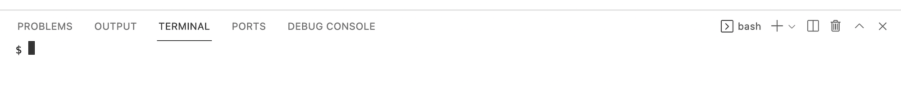

  * This terminal will be connected to our own virtual server, with its own operating system, set of files, and other installed programs that we access through the browser.
* The terminal provides a **command-line interface**, or CLI, and it allows us to access the virtual server’s operating system, [Linux](https://en.wikipedia.org/wiki/Linux).
* We’ll run a command to compile our program, `make hello`. Nothing appears to happen, but we’ll now have another file that’s just called `hello`, which we can run with `./hello`:

  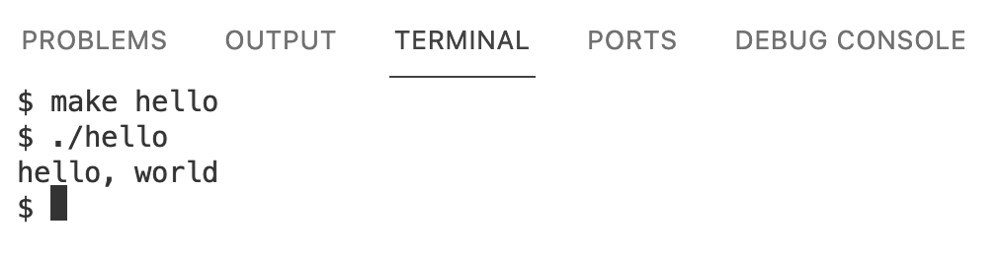

  * `./hello` tells our computer to find a file in our current folder (`.`), called `hello`, and run it. And we indeed see the output that we expected.
* We’ll open the sidebar and see that there are two files in our virtual server, one called `hello.c` (which we have open in our editor), and one called `hello`:

  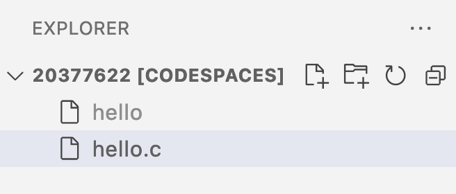

  * The `make hello` command created the `hello` file containing machine code.
  * The sidebar is a graphical user interface, or GUI, with which we can interact visually as we typically do.
* To delete a file, for example, we can right-click it in the sidebar and select the “Delete Permanently” option, but we can also use the terminal with the `rm` command:

  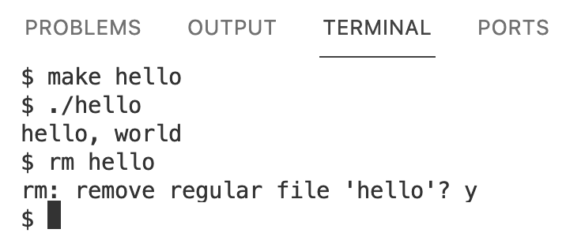

  * We run `rm hello` to remove the file called `hello`, and respond `y` for “yes” to confirm when prompted.
* We can also run the `ls` command to *list* files in our current folder. We’ll compile our file again and run `ls` to see that a file called `hello` was created:

  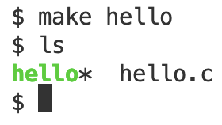

  * `hello` is in green with an asterisk, `*`, to indicate that it’s executable, or that we can run it.
* Now, if we change our source code to read a different message, and run our program with `./hello`, we won’t see the changes we made. We need to compile our code again, in order to create a new version of `hello` with machine code that we can run and see our changes in.
  * `make` is actually a program that finds and uses a compiler to create programs from our source code, and automatically names our program based on the name of the source code’s file.

## Functions, arguments, return values, variables

* Last time, we learned about functions, or actions, and arguments, or inputs to those functions that change what they do.
* The “say” block, for example, is closest to `printf` in C:
  
  

  ```c
  printf("hello, world");
  ```
  * The `f` in `printf` refers to a “formatted” string, which we’ll see again soon. And a **string** is a number of characters or words that we want to treat as text. In C, we need to surround strings with double quotes, `""`.
  * The parentheses, `()`, allow us to give an argument, or input, to our `printf` function.
  * Finally, we need a semicolon, `;`, to indicate the end of our statement or line of code.
* One type of output for a function is a **side effect**, or change that we can observe (like printing to the screen or playing a sound):

  

* In Scratch, the “say” block had a side effect:

  

* In contrast to side effects, we also saw blocks, or functions, with **return values** that we can use in our program. That return value might then be saved into a **variable**.
* In Scratch, the “ask” block, for example, stored an answer into the “answer” block:

  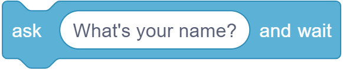

  <br>
  

  ```c
  string answer = get_string("What's your name? ");
  ```
  * In C, we have a function called `get_string()`, into which we pass the argument `"What's your name? "` as the prompt.
  * Then, we save the return value into a variable with `answer = `. Here, we’re not asking whether the two sides are equal, but rather using `=` as the **assignment operator** to set the *lef*t side to the value on the *right*.
  * Finally, we need to indicate in C that `answer` is a variable with the **type** of `string`. Another type, `int`, is short for integer, or whole number. We’ll see other types soon, but this is how our program will interpret different bytes.
    * If we try to set a value with a different type to a variable, the compiler will give us an error.
  * And just like learning a new human language, it might take weeks or months before we start automatically noticing these small details, like the semicolon. For some programming languages, the convention is to use all lowercase letters for variable and function names, but for others the conventional style might be different.
* We’ll experiment again with our original program, this time removing the `\n` from the string we pass into `printf`:
  ```c
  #include <stdio.h>
  
  int main(void)
  {
      printf("hello, world");
  }
  ```
* And now, when we compile and run our program, we won’t have the new line at the end of our message:
  ```
  $ make hello
  $ ./hello
  hello, world$
  ```
* Let’s try adding a new line within our string:
  ```c
  #include <stdio.h>

  int main(void)
  {
      printf("hello, world
      ");
  }
  ```
* Our compiler will gives us back many errors:
  ```
  $ make hello
  hello.c:5:12: error: missing terminating '"' character [-Werror,-Winvalid-pp-token]
      printf("hello, world
            ^
  hello.c:5:12: error: expected expression
  hello.c:6:5: error: missing terminating '"' character [-Werror,-Winvalid-pp-token]
      ");
      ^
  hello.c:7:2: error: expected '}'
  }
  ^
  hello.c:4:1: note: to match this '{'
  {
  ^
  4 errors generated.
  make: *** [<builtin>: hello] Error 1
  ```
  * Since many of these tools like compilers were originally written years ago, their error messages are concise and not as user-friendly as we’d like, but in this case it looks like we need to close our string with a `"` on the same line.
* When we use `\n` to create a new line, we’re using an **escape sequence**, or a way to indicate a different expression within our string. [In C](https://en.wikipedia.org/wiki/Escape_sequences_in_C), escape sequences start with a backslash, `\`.
* Now, let’s try writing a program to get a string from the user:
  ```c
  #include <stdio.h>

  int main(void)
  {
      string answer = get_string("What's your name? ");
      printf("hello, answer\n");
  }
  ```
  * We’ll add a space instead of a new line after “What’s your name?” so the user can type in their name on the same line.
* When we compile this with `make hello`, we get a lot of errors. We’ll scroll up and focus on just the first error:
  ```
  $ make hello
  hello.c:5:5: error: use of undeclared identifier 'string'; did you mean 'stdin'?
      string answer = get_string("What's your name? ");
      ^~~~~~
      stdin
  /usr/include/stdio.h:137:14: note: 'stdin' declared here
  extern FILE *stdin;             /* Standard input stream.  */
              ^
  ```
  * `hello.c:5:5` indicates that the error was found on line 5, character 5. It looks like `string` isn’t defined.
* It turns out that, in order to use certain features or functions that don’t come with C, we need to load libraries. A **library** is a common set of code, like extensions in Scratch, that we can reuse, and `stdio.h` refers to a library for standard input and output functions. With the line `#include <stdio.h>`, we’re loading this library that contains `printf`, so that we can print to the screen.
* We’ll need to also include `cs50.h`, a library written by CS50’s staffat Harvard, with helpful functions and definitions like `string` and `get_string`.
* We’ll update our code to load the library …
  ```c
  #include <cs50.h>
  #include <stdio.h>

  int main(void)
  {
      string answer = get_string("What's your name? ");
      printf("hello, answer\n");
  }
  ```
* … and now our compiler works. But when we run our program, we see `hello, answer` printed literally:
  ```
  $ make hello
  $ ./hello
  What's your name? David
  hello, answer
  $
  ```
* It turns out, we need to use a bit more syntax:
  ```c
  printf("hello, %s\n", answer);
  ```
  * With `%s`, we’re adding a placeholder for `printf` to *format* our string. Then, outside our string, we pass in the variable as another argument with `answer`, separating it from the first argument with a comma, `,`.
* Text editors for programming languages will helpfully highlight, or color-code, different types of ideas in our code:

  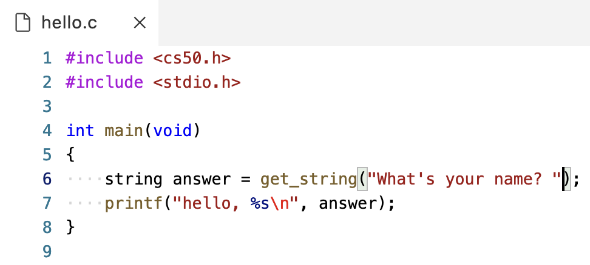
  
  * Now, it’s easier for us to see the different components of our code and notice when we make a mistake.
  * Notice that on line 6, too, when our cursor is next to a parenthesis, the matching one is highlighted as well.
  * The four dots on lines 6 and 7 also help us see the number of spaces for indentation, helping us line up our code.
* We could also use the return value from `get_string` directly as an argument, as we might have done in Scratch with nested blocks:
  ```c
  #include <cs50.h>
  #include <stdio.h>

  int main(void)
  {
      printf("hello, %s\n", get_string("What's your name? ");
  }
  ```
  * But we might consider this to be harder to read, and we aren’t able to reuse the return value later.
* Both `get_string` in C and the “ask” block in Scratch are functions that have a return value as output:

  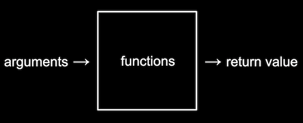

* `printf("hello, %s\n", answer);` is also similar to these Scratch blocks:

  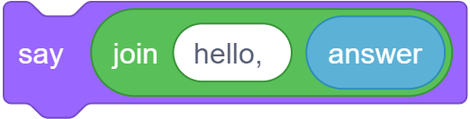

  * We’re placing a variable into our string, and displaying it right away.

## main, header files, commands

* In C, `main` achieves a similar effect as the Scratch block “when green flag clicked”:

  

  ```c
  int main(void)
  {

  }
  ```
  * The curly braces, `{` and `}`, surround the code that will run when our program is run as well.
* **Header files**, like `stdio.h`, tells our compiler which libraries to load into our program. `stdio.h` is like a menu of functions and features like `printf` that we can use in our code, though header files themselves don’t include the actual implementation.
* In Linux, there are a number of commands we might use:
  * `cd`, for changing our current directory (folder)
  * `cp`, for copying files and directories
  * `ls`, for listing files in a directory
  * `mkdir`, for making a directory
  * `mv`, for moving (renaming) files and directories
  * `rm`, for removing (deleting) files
  * `rmdir`, for removing (deleting) directories
  * …
* In our cloud-based IDE, we’re able to create new files and folders with the GUI in the sidebar:

  

* We can also use the terminal with:
  ```
  $ mkdir pset1
  $ mkdir pset2
  $ ls
  hello*  hello.c  pset1/  pset2/
  $
  ```
  * We’ll run `mkdir` twice, giving it the names of two folders we want to create. Then, we can run `ls` to see that our current directory has those folders.
* Now, we can run `cd` to change our current directory:
  ```
  $ cd pset1/
  pset1/ $ ls
  pset1/ $
  ```
  * Notice that our prompt, `$`, changes to `pset1/ $` to remind us where we are. And `ls` shows that our current directory, now `pset1`, is empty.
* We can make yet another directory and change into it:
  ```
  pset1/ $ mkdir mario
  pset1/ $ ls
  mario/
  pset1/ $ cd mario/
  pset1/mario/ $
  ```
* We’ll run a command specific to VS Code, `code mario.c`, to create a new file called `mario.c`. We see that it opens in the editor, and we can see our new folders and file in the sidebar as well:

  

* To change our current directory to the parent directory, we can run `cd ..`. We can go up two levels at once with `cd ../..` as well:
  ```
  pset1/mario/ $ cd ..
  pset1/ $ cd mario/
  pset1/mario/ $ cd ../..
  $
  ```
* `cd` on its own will also bring us back to our default directory:
  ```
  pset1/mario/ $  cd
  $
  ```
* And `.` refers to the current directory, which allows us to run a program `hello` in our current directory with `./hello`.

## Types, format codes, operators

* There are many data **types** we can use for our variables, which indicate to our program what type of data they represent:
  * `bool`, a Boolean expression of either `true` or `false`
  * `char`, a single character like `a` or `2`
  * `double`, a floating-point value with more digits than a `float`
  * `float`, a floating-point value, or real number with a decimal value
  * `int`, integers up to a certain size, or number of bits
  * `long`, integers with more bits, so they can count higher than an `int`
  * `string`, a string of characters
  * …
* And the CS50 Library has corresponding functions to get input of various types:
  * `get_char`
  * `get_double`
  * `get_float`
  * `get_int`
  * `get_long`
  * `get_string`
  * …
* For `printf`, too, there are different placeholders for each type, called **format codes**:
  * `%c` for chars
  * `%f` for floats or doubles
  * `%i` for ints
  * `%li` for long integers
  * `%s` for strings
* There are several mathematical operators we can use, too:
  * `+` for addition
  * `-` for subtraction
  * `*` for multiplication
  * `/` for division
  * `%` for remainder

## Variables, syntactic sugar

* We might create a variable called `counter` and set its value to `0` in Scratch and C with the following:

  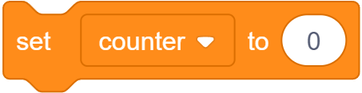

  ```c
  int counter = 0;
  ```
* And we can increase the value with:

  

  ```c
  counter = counter + 1;
  ```
  * In C, we’re taking the original value of `counter`, adding 1, and then assigning it into the left side, or updating the value of `counter`.
  * We don’t need to specify the type of `counter` again, since it’s been created already.
* C also supports **syntactic sugar**, or shorthand expressions for the same functionality. We could equivalently say `counter += 1;` to add one to `counter` before storing it again. We could also just write `counter++;`, or even `counter--;` to subtract one.

## Calculations

* Let’s create a new file in our instance of VS Code with the command `code calculator.c` in our terminal. Then, we’ll add in the following code to the editor that’s opened for us, and save the file:
  ```c
  #include <cs50.h>
  #include <stdio.h>

  int main(void)
  {
      int x = get_int("x: ");
      int y = get_int("y: ");
      printf("%i\n", x + y);
  }
  ```
  * We’ll prompt the user for two variables, `x` and `y`, and print out the sum, `x + y`, with a placeholder for integers, `%i`.
  * These shorter variable names are fine in this case, since we’re just using them as numbers without any other meaning.
* We can compile and run our program with:
  ```
  $ make calculator
  $ ./calculator
  x: 1
  y: 1
  2
  ```
* We can change our program to use a third variable, `z`:
  ```c
  int z = x + y;
  printf("%i\n", z);
  ```
  * This version gives us a reusable variable, but we might not intend on using the sum again in our program, so it might not necessarily be better.
* We can improve the style of our program with **comments**, notes to ourselves that the compiler ignores. Comments start with two slashes, `//`:
  ```c
  #include <cs50.h>
  #include <stdio.h>

  int main(void)
  {
      // Prompt user for x
      int x = get_int("x: ");

      // Prompt user for y
      int y = get_int("y: ");

      // Perform addition
      printf("%i\n", x + y);
  }
  ```
  * Since our program is fairly simple, these comments don’t *add* too much, but as our programs get more complicated, we’ll find these comments useful for reminding ourselves what and how our code is doing.
* In the terminal window, we can also start typing commands like `make ca`, and then press the `tab` key for the terminal to automatically complete our command. The up and down arrows also allow us to see previous commmands and run them without typing them again.
* We’ll compile our program to make sure we haven’t accidentally changed anything, since our comments should be ignored, and test it out:
  ```
  $ make calculator
  $ ./calculator
  x: 1000000000
  y: 1000000000
  2000000000
  $ ./calculator
  x: 2000000000
  y: 2000000000
  -294967296
  ```
  * It turns out that data types each use a fixed number of bits to store their values. An `int` in our virtual environment uses 32 bits, which can only contain about four billion (2<sup>32</sup>) different values. But since integers can be positive or negative, the highest positive value for an `int` can only be about two billion, with a lowest negative value of about negative two billion.
* We can change our program to store and display the result as a `long`, with more bits:
  ```c
  #include <cs50.h>
  #include <stdio.h>

  int main(void)
  {
      // Prompt user for x
      long x = get_long("x: ");

      // Prompt user for y
      long y = get_long("y: ");

      // Perform addition
      printf("%li\n", x + y);
  }
  ```
  * But we could still have a value that’s too large, which is a general problem we’ll discuss again later.

## Conditionals, Boolean expressions

* In Scratch, we had conditional, or “if”, blocks, like:

  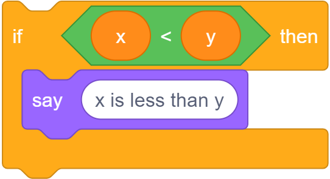

* In C, we similarly have:
  ```c
  if (x < y)
  {
      printf("x is less than y");
  }
  ```
  * Notice that in C, we use `{` and `}` (as well as indentation) to indicate how lines of code should be nested.
  * And even though `if` is followed by parentheses, it is not a function. We also don’t use semicolons after the conditionals.
* We can have “if” and “else” conditions:

  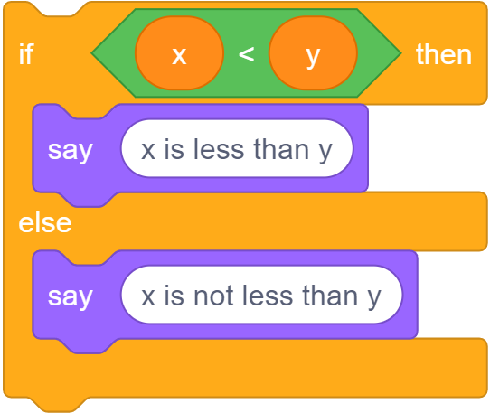

  ```c
  if (x < y)
  {
      printf("x is less than y\n");
  }
  else
  {
      printf("x is not less than y\n");
  }
  ```
* And in C, we can use “else if”:

  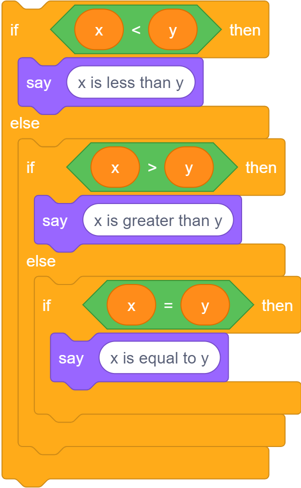

  ```c
  if (x < y)
  {
      printf("x is less than y\n");
  }
  else if (x > y)
  {
      printf("x is greater than y\n");
  }
  else if (x == y)
  {
      printf("x is equal to y\n");
  }
  ```
  * Notice that, to compare two values in C, we use two equals signs, `==`.
  * And, logically, we don’t need the `if (x == y)` in the final condition, since that’s the only case remaining. Instead of asking three different questions, we can just ask two, and if both of the first cases are false, we can just say `else`:
    ```c
    if (x < y)
    {
        printf("x is less than y\n");
    }
    else if (x > y)
    {
        printf("x is greater than y\n");
    }
    else
    {
        printf("x is equal to y\n");
    }
    ```
* Let’s write another program. We’ll start by running `code points.c` in our terminal window, and in the text editor, add:
  ```c
  #include <cs50.h>
  #include <stdio.h>

  int main(void)
  {
      int points = get_int("How many points did you lose? ");

      if (points < 2)
      {
          printf("You lost fewer points than me.\n");
      }
      else if (points > 2)
      {
          printf("You lost more points than me.\n");
      }
      else if (points == 2)
      {
          printf("You lost the same number of points as me.\n");
      }
  }
  ```
* We’ll run `make points`, and try it a few times:
  ```
  $ make points
  $ ./points
  How many points did you lose? 1
  You lost fewer points than me.
  $ ./points
  How many points did you lose? 0
  You lost fewer points than me.
  $ ./points
  How many points did you lose? 3
  You lost more points than me.
  ```
* But in our program, we’ve included the same **magic number**, or value that comes from somewhere unknown, in two places. Instead of comparing the number of points against `2` in both cases manually, we can create a **constant**, a variable that we aren’t able to change:
  ```c
  #include <cs50.h>
  #include <stdio.h>

  int main(void)
  {
      const int MINE = 2;
      int points = get_int("How many points did you lose? ");

      if (points < MINE)
      {
          printf("You lost fewer points than me.\n");
      }
      else if (points > MINE)
      {
          printf("You lost more points than me.\n");
      }
      else
      {
          printf("You lost the same number of points as me.\n");
      }
  }
  ```
  * The `const` keyword tells our compiler to ensure that the value of this variable isn’t changed, and by convention the name of the variable should be in all uppercase, `MINE` (to represent the number of my points).
  * By convention, too,
* We’ll write another program called [`parity.c`](https://cdn.cs50.net/2021/fall/lectures/1/src1/parity.c?highlight):
  ```c
  #include <cs50.h>
  #include <stdio.h>

  int main(void)
  {
      int n = get_int("n: ");

      if (n % 2 == 0)
      {
          printf("even\n");
      }
      else
      {
          printf("odd\n");
      }
  }
  ```
  * The `%` operator gives us the remainder of `n after we divide it by `2`. If it is `0`, then `n` is an even number. Otherwise, it’s an odd number.
* And we can make and test our program in the terminal:
  ```
  $ make parity
  $ ./parity
  n: 2
  even
  $ ./parity
  n: 4
  even
  $ ./parity
  n: 3
  odd
  ```
* We’ll look at another program, [`agree.c`](https://cdn.cs50.net/2021/fall/lectures/1/src1/agree.c?highlight):
  ```c
  #include <cs50.h>
  #include <stdio.h>

  int main(void)
  {
      // Prompt user to agree
      char c = get_char("Do you agree? ");

      // Check whether agreed
      if (c == 'Y' || c == 'y')
      {
          printf("Agreed.\n");
      }
      else if (c == 'N' || c == 'n')
      {
          printf("Not agreed.\n");
      }
  }
  ```
  * First, we can get a single character, `char`, with `get_char()`. Then, we’ll check whether the response is `Y` or `y`, *or* `N` or `n`. In C, we can ask two questions with “or”, represented by two vertical bars, `||`, to check if at least one of them has an answer of true. (If we wanted to check that both questions have an answer of true, we would use “and”, represented by ampersands, `&&`.)
  * In C, a `char` is surrounded by single quotes, `'`, instead of double quotes for strings. (And strings with just a single character will still have double quotes, since they are a different data type.)

## Loops, functions

* We’ll write a program to print “meow” three times, as we did in Scratch:
  ```c
  #include <stdio.h>

  int main(void)
  {
      printf("meow\n");
      printf("meow\n");
      printf("meow\n");
  }
  ```
  * But we could improve the design of our code with a loop.
* The “forever” block in Scratch can be recreated with a while loop in C:

  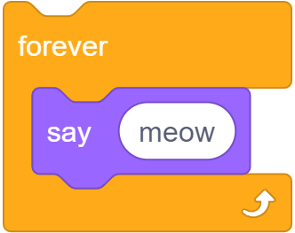

  ```c
  while (true)
  {
      printf("meow\n");
  }
  ```
  * A `while` loop repeats over and over as long as the expression inside is true, and since `true` will always be true, this loop will repeat forever.
* We can also recreate the “repeat” block with a variable and a while loop:

  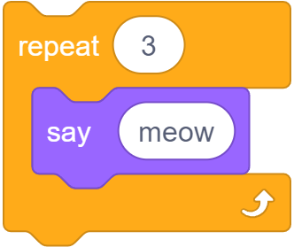

  ```c
  int counter = 0;
  while (counter < 3)
  {
      printf("meow\n");
      counter = counter + 1;
  }
  ```
  * We’ll create a variable, `counter`, and set it to `0` at first. This will represent the number of times our loop has run.
  * Then, we’ll have our while loop repeat as long as `counter` is less than `3`.
  * Each time our loop repeats, we’ll print “meow” to the screen, and then increase the value of `counter` by one.
* We can simplify our loop slightly:
  ```c
  int i = 0;
  while (i < 3)
  {
      printf("meow\n");
      i++;
  }
  ```
  * Since we’re using the variable `counter` just as a mechanism for counting, we can use `i` as a conventional variable name.
  * We start `i` at `0` by convention as well, so by the time `i` reaches `3`, our loop will have repeated 3 times.
* It turns out that this is a common pattern, so in C we can use a for loop:
  ```c
  for (int i = 0; i < 3; i++)
  {
      printf("meow\n");
  }
  ```
  * The logic in the first line is the same as what we just saw in a while loop. First, a variable `i` is created and initialized to `0` with `int i = 0`. (Each of these pieces are separated by a semicolon, just because of how the language was originally designed.) Then, the condition that is checked for every cycle of the loop is `i < 3`. Finally, after executing the code inside the loop, the last piece, `i++`, will be executed.
  * One minor difference with a for loop, compared to a while loop, is that the variable created within a for loop will only be accessible within the loop. In contrast, the variable `i` we created outside the while loop will still be accessible after the while loop finishes.
* We’ll use a loop to “meow” three times in our program:
  ```c
  #include <stdio.h>

  int main(void)
  {
      for (int i = 0; i < 3; i++)
      {
          printf("meow\n");
      }
  }
  ```
  * We can compile and run our program:
    ```
    $ make meow
    $ ./meow
    meow
    meow
    meow
    $
    ```
* Now we can start creating our own functions, like custom blocks in Scratch:
  ```c
  #include <stdio.h>

  void meow(void)
  {
      printf("meow\n");
  }

  int main(void)
  {
      for (int i = 0; i < 3; i++)
      {
          meow();
      }
  }
  ```
  * We define our function with `void meow(void)`. The first `void` means that there isn’t a return value for our function. The `void` within the parentheses also indicates that the function doesn’t take any arguments, or inputs.
  * The lines of code in the curly braces that follow will be the code that runs every time our function is called.
* We can move our function to the bottom of our file, since we don’t need to know how it’s implemented right away:
  ```c
  #include <stdio.h>

  int main(void)
  {
      for (int i = 0; i < 3; i++)
      {
          meow();
      }
  }

  void meow(void)
  {
      printf("meow\n");
  }
  ```
* But now, when we try to compile our program, we see some errors:
  ```
  $ make meow
  meow.c:7:11: error: implicit declaration of function 'meow' is invalid in C99 [-Werror,-Wimplicit-function-declaration]
            meow();
            ^
  meow.c:11:8: error: conflicting types for 'meow'
    void meow(void)
        ^
  meow.c:7:11: note: previous implicit declaration is here
            meow();
            ^
  2 errors generated.
  make: *** [<builtin>: meow] Error 1
  ```
  * We’ll start with the first one, and it turns out that our “implicit declaration”, or use of the function without defining it first, is not allowed.
* The compiler reads our code from top to bottom, so it doesn’t know what the `meow` function is. We can solve this by **declaring** our function with a **prototype**, which just tells the compiler that we’ll define our function later with the return type and argument type specified:
  ```c
  #include <stdio.h>

  void meow(void);

  int main(void)
  {
      for (int i = 0; i < 3; i++)
      {
          meow();
      }
  }

  void meow(void)
  {
      printf("meow\n");
  }
  ```
  * `void meow(void);` is our function’s prototype. Notice that we don’t actually write the implementation of the function until later in our code.
* We can add an argument to our `meow` function:
  ```c
  #include <stdio.h>

  void meow(int n);

  int main(void)
  {
      meow(3);
  }

  void meow(int n)
  {
      for (int i = 0; i < n; i++)
      {
          printf("meow\n");
      }
  }
  ```
  * With `void meow(int n)`, we’re changing our function to take in some input, `n`, which will be an integer.
  * Then, in our for loop, we can check `i < n` so that we repeat the loop the right number of times.
  * Finally, in our `main` function, we can just call `meow`, giving it an input for the number of times we want to print “meow”.
* Header files, ending in `.h`, include prototypes like `void meow(int n);`. Then, library files will include the actual implementation of each of those functions.
* We’ll explore how our `main` function takes inputs and returns a value with `int main(void)` another day.

## Mario

* Let’s try to print out some blocks to the screen, like those from the video game [Super Mario Bros.](https://en.wikipedia.org/wiki/Super_Mario_Bros.) We’ll start with printing four question marks, simulating blocks:
  ```c
  #include <stdio.h>

  int main(void)
  {
      printf("????\n");
  }
  ```
* With a for loop, we can print any number of question marks with better design:
  ```c
  #include <stdio.h>

  int main(void)
  {
      for (int i = 0; i < 4; i++)
      {
          printf("?");
      }
      printf("\n");
  }
  ```
  * After our for loop, we can print a new line. Then we can compile and run our program:
    ```
    $ make mario
    $ ./mario
    ????
    $
    ```
* Let’s get a positive integer from the user, and print out that number of question marks, by using a **do while** loop:
  ```c
  #include <cs50.h>
  #include <stdio.h>

  int main(void)
  {
      int n;
      do
      {
          n = get_int("Width: ");
      }
      while (n < 1);

      for (int i = 0; i < n; i++)
      {
          printf("?");
      }
      printf("\n");
  }
  ```
  * A do while loop does something first, and *then* checks whether the condition is true. If the condition is still true, then it repeats itself. Here, we’re declaring an integer `n` without specifying a value. Then, we ask the user, with `get_int`, what the value of `n` should be. Finally, we repeat and ask the user for another input only if `n < 1`, since we want to print at least one question mark.
  * We’ll also change our for loop to use `n` as the number of times we print the question marks.
  * We can compile and run our program:
    ```
    $ make mario
    $ ./mario
    Width: 4
    ????
    $ ./mario
    Width: 40
    ????????????????????????????????????????
    $
    ```
* And we can print a two-dimensional set of blocks with nested loops, or loops one inside the other:
  ```c
  #include <cs50.h>
  #include <stdio.h>

  int main(void)
  {
      int n;
      do
      {
          n = get_int("Size: ");
      }
      while (n < 1);

      // For each row
      for (int i = 0; i < n; i++)
      {
          // For each column
          for (int j = 0; j < n; j++)
          {
              // Print a brick
              printf("#");
          }

          // Move to next row
          printf("\n");
      }   
  }
  ```
  * We have two nested loops, where the outer loop uses `i` to do some set of things `n` times. The inner loop uses `j` (another conventional variable for counting), a different variable, to do something `n` times for *each* of those times. In other words, the outer loop prints 3 rows, ending each of them with a new line, and the inner loop prints 3 bricks, or `#` characters, for each line:
    ```
    $ make mario
    $ ./mario
    Size: 3
    ###
    ###
    ###
    $
    ```
* We can stop a loop early as well. Instead of the do while loop from earlier, we can use a while loop:
  ```c
  while (true)
  {
      n = get_int("Size: ");
      if (n > 1)
      {
          break;
      }
  }
  ```
  * With `break`, we can break out of the while loop, which would otherwise repeat forever.

## Imprecision, overflow

* Let’s take a look at calculating values again, this time with floats and division:
  ```c
  #include <cs50.h>
  #include <stdio.h>

  int main(void)
  {
      // Prompt user for x
      float x = get_float("x: ");

      // Prompt user for y
      float y = get_float("y: ");

      // Divide x by y
      float z = x / y;

      printf("%f\n", z);
  }
  ```
* We can compile and test our program:
  ```
  $ make calculator
  $ ./calculator
  x: 2
  y: 3
  0.666667
  $ ./calculator
  x: 1
  y: 10
  0.100000
  $
  ```
* It turns out, with format codes like `%.2f`, we can specify the number of decimal places displayed. Let’s change our program to print fifty decimal places with `printf("%.50f\n", z);`. We’ll compile and run our program again:
  ```
  $ make calculator
  $ ./calculator
  x: 2
  y: 3
  0.66666668653488159179687500000000000000000000000000
  $ ./calculator
  x: 1
  y: 10
  0.10000000149011611938476562500000000000000000000000
  ```
  * Now, the values don’t seem to be what we expect.
* It turns out that this is called **floating-point imprecision**, the inability for computers to represent all possible real numbers with a finite number of bits, like 32 bits for a `float`. So, our computer has to store the closest value it can, leading to imprecision.
  * In other languages, there are other ways to represent decimal values with more and more bits, though there is still a fundamental limit to the degree of accuracy.
* Similarly, earlier this year, when we had three bits and needed to count higher than seven (or `111`), we added another bit to represent eight with `1000`. But if we only had three bits available, the “next” number would be `000`, since we wouldn’t have a place for the extra `1`. This problem is called **integer overflow**, where an integer can only be so large given a finite number of bits.
* The Y2K problem arose because many programs stored the calendar year with just two digits, like `98` for 1998, and `99` for 1999. But when the year 2000 approached, the programs had to store only `00`, leading to confusion between the years 1900 and 2000.
* In 2038, we’ll also run out of bits to track time, since many years ago some humans decided to use 32 bits as the standard number of bits to count the number of seconds since January 1st, 1970. But since a 32-bit integer can only count up to about two billion, in 2038 we’ll also reach that limit.
  * The 32 bits of an integer representing 2147483647 look like:
    ```
    01111111111111111111111111111111
    ```
  * When we increase that by 1, the bits will actually look like:
    ```
    10000000000000000000000000000000
    ```
  * But the first bit in an integer represents whether or not it’s a negative value, so the decimal value will actually be -2147483648, the lowest possible *negative* value of an `int`. So computers might actually think it’s sometime in 1901.
* Fortunately, we have more hardware these days, so we can start allocating more and more bits to store higher and higher values.
* We’ll see one last example:
  ```c
  #include <cs50.h>
  #include <stdio.h>

  int main(void)
  {
      float amount = get_float("Dollar Amount: ");
      int pennies = amount * 100;
      printf("Pennies: %i\n", pennies);
  }
  ```
  * We’ll compile and run our program:
    ```
    $ make pennies
    $ ./pennies
    Dollar Amount: .99
    Pennies: 99
    $ ./pennies
    Dollar Amount: 1.23
    Pennies: 123
    $ ./pennies
    Dollar Amount: 4.20
    Pennies: 419
    ```
* It turns out that there’s imprecision in storing the `float` we get from the user (`4.20` might be stored as `4.199999...`), and so when we multiply it and display it as an integer, we see `419`.
* We can try to solve this by rounding:
  ```c
  #include <cs50.h>
  #include <math.h>
  #include <stdio.h>

  int main(void)
  {
      float amount = get_float("Dollar Amount: ");
      int pennies = round(amount * 100);
      printf("Pennies: %i\n", pennies);
  }
  ```
  * `math.h` is another library that allows us to round numbers.
* Unfortunately, these bugs and mistakes happen all the time. For example, in the past some airplane’s software needed to be restarted every 248 days, since one of its counters for time was overflowing as well.


---

  * This is equivalent to the "when green flag clicked" and "say (hello, world)" block:<br>
    
* We can compare a lot of the constructs in C, to blocks we've already seen and used in Scratch. The syntax is far less important than the principles, which we've already been introduced to.
* The "say (hello, world)" block is a function, and maps to `printf("hello, world\n");`[^1]. In C, the function to print something to the screen is `printf`, where `f` stands for "format", meaning we can format the string in different ways. Then, we use parentheses to pass in what we want to print. We use double quotes to surround our text, or string, and add a `\n` which indicates a new line on the screen. (Then, the next time we call `printf`, our text will be on a new line. Finally, we add a semicolon `;` to end this line of code in C.
* The "set [counter] to (0)" block is creating a variable, and in C we would say `int counter = 0;`, where `int` specifies that the type of our variable is an integer and the equals sign indicates assignment [^2]
:<br>
  
* "change [counter] by (1)" is `counter = counter + 1;` in C. (In C, the `=` isn't like an equation, where we are saying `counter` is the same as `counter + 1`. Instead, `=` means "copy the value on the right, into the value on the left".) We can also say `counter += 1;` or `counter++;` both of which are "syntactic sugar", or shortcuts that have the same effect with fewer characters to type.<br>
  
* A condition[^3] would map to:<br>
  
  ```c
  if (x < y)
  {
      printf("x is less than y\n");
  }
  ```
  * Notice that in C, we use `{` and `}` (as well as indentation) to indicate how lines of code should be nested.
* We can also have if-else conditions:<br>
  
  ```c
  if (x < y)
  {
      printf("x is less than y\n");
  }
  else
  {
      printf("x is not less than y\n");
  }
  ```
  * As another aside, whitespace (the spaces, new lines, and indentation) are generally not syntactically important in C, i.e. they won't change how our program ultimately runs, but following conventions and having good "style" is important for our code to be readable by humans.
* And even `else if`:<br>
  
  ```c
  if (x < y)
  {
      printf("x is less than y\n");
  }
  else if (x > y)
  {
      printf("x is greater than y\n");
  }
  else if (x == y)
  {
      printf("x is equal to y\n");
  }
  ```
  * Notice that, to compare two values in C, we use `==`, two equals signs.
  * And, logically, we don't need the `if (x == y)` in the final condition, since that's the only case remaining, and we can just say `else`.
* Loops can be written like the following:<br>
  
  ```c
  while (true)
  {
      printf("hello, world\n");
  }
  ```
  * The `while` keyword also requires a condition, so we use `true` as the Boolean expression to ensure that our loop will run forever. Our program will check whether the expression evaluates to `true` (which it always will in this case), and then run the lines inside the curly braces. Then it will repeat that until the expression isn't true anymore (which won't change in this case).<br>
  
  ```c
  for (int i = 0; i < 50; i++)
  {
      printf("hello, world\n");
  }
  ```
  * To write a loop that runs a specific number of times, we use the `for` keyword[^4], and first, we create a variable named `i` and set it to 0. `i` is a conventional name for a variable that keeps track of how many iterations of the loop we've already done. Then, we check that `i < 50` every time we reach the top of the loop, before we run any of the code inside. If that expression is true, then we run the code inside. Finally, after we run the code inside, we use `i++` to add one to `i`, and the loop repeats.
* We can also get input from the user:<br>
  
  ```c
  string answer = get_string("What's your name?\n");
  printf("%s\n", answer);
  ```
  * In Scratch, the response will be stored in a variable called "answer", but in C we can specify the name of the variable. We'll choose "answer" too, and the type of this variable is `string`, which is just a sequence of characters.
  * And we'll use `printf` to print the string, but we need to specify how. We first pass in `"%s`, the string we want to print, which happens to be just `%s`. And `%s` is a placeholder, into which `printf` will substitute the value of the string we pass in next, which we specify as `answer`.
  * And we need this structure because now, we can convert this:<br>
    
    ```c
    string answer = get_string("What's your name?\n");
    printf("hello, %s\n", answer);
    ```

## CS50 Sandbox

* The [CS50 Sandbox](https://sandbox.cs50.io/) is a cloud-based, virtual environment where we've installed the right libraries and settings so that we can all start writing and running code the same way. At the top, there is a simple code editor, where we can type text. Below, we have a terminal window, into which we can type commands:<br>
  
* We'll type our code from earlier into the top:<br>
  
  * Notice that our code is colorized, so that certain things are more visible.
  * And we write our code and save it into a file, to something like `hello.c` to indicate that it is written in C.
* Once we save the code that we wrote, which is called *source code*, we need to convert it to *machine code*, binary instructions that the computer understands more directly.
  * We use a program called a *compiler* to compile our source code into machine code.
* To do this, we use the Terminal panel. The `$` at the left is a prompt, into which we can type commands.
* We type `clang hello.c` (where `clang` stands for "C languages") and ... nothing happens. We see another `$`, waiting for another command. We can click the folder icon on the top left of CS50 Sandbox, and see that we have another file now, called `a.out`. Now, we can type `./a.out` in the terminal prompt, and see `hello, world`. We just wrote, compiled, and ran our first program!
* We can change the name of our program from `a.out` to something else. We can pass *command-line arguments* to programs in the terminal, if they accept them. For example, we can type `clang -o hello hello.c`, and `-o hello` is telling the program `clang` to save the compiled output as just `hello`. Then, we can just run `./hello`. (The `.` means the current folder.)
* We can even abstract this away and just type `make hello`. We see that, by default (in the CS50 Sandbox), `make` uses `clang` to compile our code from `hello.c` into `hello`, with other special features.
* Now, let's try to get input from the user.
  ```c
  #include <stdio.h>

  int main(void)
  {
      string name = get_string("What is your name?\n");
      printf("hello, name\n");
  }
  ```
  * If we run `make hello`, we get lots and lots of errors now. But, in cases like this, we should scroll up to the top, and see what that error is, since the first one might have led to all the others.
  * We see that the first error is `hello.c:5:5: error: use of undeclared identifier 'string' ...`. This tells us that, on line 5, character 5, of the file `hello.c`, the compiler encountered something called `string` that it didn't recognize. In fact, the language C doesn't have a type called `string`.
* To simplify things (at least for the beginning), we'll include a library, or set of code, from CS50. The library provides us with the `string` variable type, the  `get_string` function, and more. We just have to write a line at the top to `include` the file `cs50.h`:
  ```c
  #include <cs50.h>
  #include <stdio.h>

  int main(void)
  {
      string name = get_string("What is your name?\n");
      printf("hello, name\n");
  }
  ```
  * And `stdio.h` is a library that comes with C, that stands for "standard input/output", which includes the `printf` function that prints to the screen,
* Now, if we try to compile that code, our first error is `hello.c:6:12: error: unused variable 'name' ...`. It turns out, we didn't do anything with the `name` variable after we created it. To do that, we need to change the next line:
  ```c
  #include <cs50.h>
  #include <stdio.h>

  int main(void)
  {
      string name = get_string("What is your name?\n");
      printf("hello, %s\n", name);
  }
  ```
  * We're passing in two arguments, or parameters, to `printf`. The first is the string we want to print, with our `%s` placeholder, and the second is the variable `name` that we want to substitute in.
* If we change our code, we need to save our file and run `make hello` again. And, if we wanted to stop our program before it finishes, we just need to press control-C.
* Functions, like `get_string` or `printf`, can take arguments. They can also have return values, and `get_string` returns something of the type `string`.
* You can find the full documentation for the CS50 Sandbox at [cs50.readthedocs.io](cs50.readthedocs.io/sandbox)

## More examples

* The CS50 library has other functions, getting input of various types:
  * `get_char`
  * `get_double`
  * `get_float`
  * `get_int`
  * `get_long`
  * `get_string`
  * ...
* And there are corresponding types in C and ways to print them with `printf`:
  * `bool`
  * `char`, `%c`
  * `double`
  * `float`, `%f`
  * `int`, `%i`
  * `long`, `%li`
  * `string`, `%s`
* The CS50 Sandbox has various languages we can choose from, as well as a file name we can get started with.
* In fact, for each of these examples, you can click on the sandbox links on the [curriculum](https://cs50.harvard.edu/2018/fall/weeks/1/) to run and edit your own copies of them.
* In `int.c`, we get and print an integer:
  ```c
  #include <cs50.h>
  #include <stdio.h>

  int main(void)
  {
      int i = get_int("Integer: ");
      printf("hello, %i\n", i);
  }
  ```
  * Notice that we use `%i` to print an integer.
  * `int main(void)` is the equivalent of "when green flag clicked", and we'll learn more about that in the coming weeks.
  * We can now run `make int` and run our program with `./int`.
* In `float.c`, we can get decimal numbers (called floating-point values in computers, because the decimal point can "float" between the digits, depending on the number):
  ```c
  #include <cs50.h>
  #include <stdio.h>

  int main(void)
  {
      float f = get_float("Float: ");
      printf("hello, %f\n", f);
  }
  ```
  * Now, if we compile and run our program, we see something like `hello, 42.000000`, even if we just typed in `42` at the prompt.
* With `ints.c`, we can do some math[^5]:
  ```c
  #include <cs50.h>
  #include <stdio.h>

  int main(void)
  {
      // Prompt user for x
      int x = get_int("x: ");

      // Prompt user for y
      int y = get_int("y: ");

      // Perform arithmetic
      printf("x + y = %i\n", x + y);
      printf("x - y = %i\n", x - y);
      printf("x * y = %i\n", x * y);
      printf("x / y = %i\n", x / y);
      printf("x mod y = %i\n", x % y);
  }
  ```
  * First, we get two integers, `x` and `y`. Then, we print out what we want to do, like `x + y = %i\n`, and pass in the value we want, `x + y`. `*` is used for multiplication, and `/` for division. `%` on its own, between two variables, is the [modulo operator](https://en.wikipedia.org/wiki/Modulo_operation). [^6]
  * Interestingly, when we pass in `2` for `x` and `10` for `y`, we got ... `x - y = 0`. It turns out, since the two variables are integers, the result is an integer, and since 2 divided by 10 is less than 1, all we have left is the 0.
* With `floats.c`, we can see what happens when we use floats:
  ```c
  #include <cs50.h>
  #include <stdio.h>

  int main(void)
  {
      // Prompt user for x
      float x = get_float("x: ");

      // Prompt user for y
      float y = get_float("y: ");

      // Perform division
      printf("x / y = %.50f\n", x / y);
  }
  ```
  * With `%50f`, we can specify the number of decimal places displayed.
  * Hmm, now we get ...
  ```
  x: 2
  y: 10
  x / y = 0.20000000298023223876953125000000000000000000000000
  ```
* Our computer has memory, in hardware chips called RAM, random-access memory. Our programs use that RAM to store data as they run, but that memory is finite. So with a finite number of bits, we can't represent all possible numbers (of which there are an infinite number of). So our computer has a certain number of bits for each float, and has to round to the nearest decimal value at a certain point.
* And these imprecisions can be problematic in finance, rockets, or scientific applications. But we can get around this problem, by specifying the number of decimal places we will be precise to, and allocate the right number of bits to represent that many decimal places.
* A float in C, on most computers, uses 4 bytes, or 32 bits. Another type, called a double, uses twice as many bits, or 8 bytes.
* If we run `doubles.c`, which is `floats.c` but with the `double` type for variables, we see that we have many more decimal digits of precision. And the tradeoff for the additional precision is that we now have to use more memory space.
* Let's look at `parity.c`:
  ```c
  #include <cs50.h>
  #include <stdio.h>

  int main(void)
  {
      // Prompt user for integer
      int n = get_int("n: ");

      // Check parity of integer
      if (n % 2 == 0)
      {
          printf("even\n");
      }
      else
      {
          printf("odd\n");
      }
  }
  ```
  * By taking the remainder after we divide `n` by 2, we can tell whether `n` is even or odd.
* In `conditions.c`, we turn the snippet from before into a program:
  ```c
  #include <cs50.h>
  #include <stdio.h>

  int main(void)
  {
      // Prompt user for x
      int x = get_int("x: ");

      // Prompt user for y
      int y = get_int("y: ");

      // Compare x and y
      if (x < y)
      {
          printf("x is less than y\n");
      }
      else if (x > y)
      {
          printf("x is greater than y\n");
      }
      else
      {
          printf("x is equal to y\n");
      }
  }
  ```
* In `answer.c`, we get text from the user:
  ```c
  #include <cs50.h>
  #include <stdio.h>

  int main(void)
  {
      // Prompt user for answer
      char c = get_char("Answer: ");

      // Check answer
      if (c == 'Y' || c == 'y')
      {
          printf("yes\n");
      }
      else if (c == 'N' || c == 'n')
      {
          printf("no\n");
      }
  }
  ```
  * Here, we use `get_char` and the `char` data type to get a single character from the user.
* The algorithms we use here can be helpful for building more complex algorithms. We could imagine that we could use the sum algorithm as a start to build a program that takes the average of multiple numbers. Similarly we can think about the programs we write for physical objects like robots. The algorithms to move a robot forwards, backwards, left, and right is likely something someone has already implemented, but we could build something more complex based off of that like determining the robot's path through a maze.
  #### Logical Operators
  * The logical operators we have access to are "and", "or", and "not"[^7].
  * | C syntax | Operator | Example (suppose `x = 5` and `y = 4`) |
|:----------:|:------:|-------------------------------|
| `&&` | AND | `x < 10 && y > 3` --> `true` |
| `||` | OR | `x < 2 || y > 3` --> `true` |
| `!` | NOT | `!(x==y)` --> `true` |
  * Notice that we use a `||` to indicate an "or" in our Boolean expression. (A logical "and" would be `&&`.)
* In Scratch, we were able to create our own block, that we called "cough". We can do the same in C, by creating our own function.
* If we wanted to print "cough" 3 times, we could use a `for` loop:
  ```c
  #include <stdio.h>

  int main(void)
  {
      for (int i = 0; i < 3; i++)
      {
          printf("cough\n");
      }
  }
  ```
* We can move the `printf` line to its own function:
  ```c
  #include <stdio.h>

  void cough(void);

  int main(void)
  {
      for (int i = 0; i < 3; i++)
      {
          cough();
      }
  }

  // Cough once
  void cough(void)
  {
      printf("cough\n");
  }
  ```
  * Notice that we need to declare that the `cough` function exists, so we need the prototype, `void cough(void);`, before our `main` function calls it. The C compiler reads our code from top to bottom, so we need to tell it that the `cough` function exists, before we use it. And we want to keep our `main` function close to the top, so the actual implementation of `cough` will still be below it.
  * In fact, `cs50.h` and `stdio.h` are both header files, containing prototypes for functions like `get_string` and `printf` that we can then use. The actual implementation of those files are in `cs50.c` and `stdio.c` as source code, and compiled to files elsewhere on the system.
  * And our `cough` function doesn't take any inputs, so we have `cough(void)`, and the function also doesn't return anything, so we have `void` in front of `cough` as well. (Our `main` function is supposed to return an `int`, and by default it will return `0` if nothing goes wrong.)
* We can abstract `cough` further:
  ```c
  #include <stdio.h>

  void cough(int n);

  int main(void)
  {
      cough(3);
  }

  // Cough some number of times
  void cough(int n)
  {
      for (int i = 0; i < n; i++)
      {
          printf("cough\n");
      }
  }
  ```
  * Now, when we want to print "cough" some number of times, we can just call that same function. Notice that, with `cough(int n)`, we indicate that the `cough` function takes as input an `int`, which we refer to as `n`. And inside `cough`, we use `n` in our `for` loop to print "cough" the right number of times.
* Let's look at `positive.c`:
  ```c
  #include <cs50.h>
  #include <stdio.h>

  int get_positive_int(string prompt);

  int main(void)
  {
      int i = get_positive_int("Positive integer: ");
      printf("%i\n", i);
  }

  // Prompt user for positive integer
  int get_positive_int(string prompt)
  {
      int n;
      do
      {
          n = get_int("%s", prompt);
      }
      while (n < 1);
      return n;
  }
  ```
  * The CS50 library doesn't had a `get_positive_int` function, but we can write one ourselves. In our function, we initialize a variable, `int n`, but not assign a value to it yet. Then, we have a new construct, `do ... while`, which does something _first_, then checks a condition, and repeats until the condition is no longer true.
  * Then, once we have an `n` that is not `< 1`, we can return it with the `return` keyword. And back in our `main` function, we can set `int i` to that value.
  * In C, variables also have *scope*, which generally means that they only exist within the curly braces that they were declared. For example, if we had `int n = get_int(...)` within the do-while loop, we wouldn't be able to `return` it, since that line would be outside of the scope of `n`. (Similarly, our `main` function can't directly see any variables inside `get_positive_int`, since each function has its own set of curly braces and thus different scopes for variables declared inside them.)
* In Scratch, you might have noticed that you could make a variable available to one sprite, or all sprites. And in C, we have both *local* and *global* variables. All variables we've seen thus far are local, though eventually we'll see global variables, which we'll be able to use anywhere in our program.

## More problems

* We've already seen an example of floating-point imprecision, but we can also have problems with integers.
* If, for example, we had a number like 129, to which we added a 1, we wouldn't have 1210, where the last digit went from 9 to 10. Instead, we carry the 1, such that the number we have is 130. And if we had a number like 999, we would carry the 1 a few times, until we got the number 1000.
* But if we only had space to write down 3 digits, we would end up with 000. And this problem is called overflow, where the number we are trying to store is too big for the amount of space we have allocated.
* In binary, if we had the number `111`, and added 1, we would carry that 1 until we got `1000`. And similarly, if we only had 3 bits, we would have `000`.
* In the Lego Star Wars game, there is a set maximum of 4 billion coins that the player can collect, since presumably there are only 32 bits used to store that count (and 2 to the power of 32 is slightly over 4 billion).
* We can see this in `overflow.c`:
  ```c
  #include <stdio.h>
  #include <unistd.h>

  int main(void)
  {
      // Iteratively double i
      for (int i = 1; ; i *= 2)
      {
          printf("%i\n", i);
          sleep(1);
      }
  }
  ```
  * Notice that here, we have a line that starts with `//`, which indicates a comment. A comment is a note to ourselves or future readers, that the compiler will ignore. Not all environments will support textual comments in the same way, so it is important to think about other ways to document your code.
  * In our `for` loop, we set `i` to `1`, and double it with `*= 2`. (And we'll keep doing this forever, so there's no condition we check.)
  * We also use the `sleep` function from `unistd.h` to let our program pause each time.
  * Now, when we run this program, we see the number getting bigger and bigger, until:
    ```
    1073741824
    overflow.c:9:31: runtime error: signed integer overflow: 1073741824 * 2 cannot be represented in type 'int'
    -2147483648
    0
    0
    ...
    ```
  * It turns out, our program recognized that a signed integer (an integer with a positive or negative sign) couldn't store that next value, and printed an error. Then, since it tried to double it anyways, `i` became a negative number, and then 0.
* The Y2K problem arose because many programs stored the calendar year with just two digits, like 98 for 1998, and 99 for 1999. But when the year 2000 approached, the programs would have stored 00, leading to confusion between the years 1900 and 2000.
* A Boeing 787 airplane also had a bug where a counter in the generator overflows after a certain number of days of continuous operation, since the number of seconds it has been running could no longer be stored in that counter.
* In an older version of Civilization, integer underflow leads to one of the characters, Gandhi, becoming much more aggressive since his "aggression" value, already low,  becomes large when too much is subtracted from it. For example, if we had `00000001` stored, and subtract 1 from it, we would have `00000000`. But if we were to subtract 2, we actually roll backwards to `11111111`, which is the largest positive value!
* So, we've seen a few problems that can happen, but hopefully now too understand why and how to prevent them.
* With this week's problem set, we'll use the CS50 Lab, built on top of the CS50 Sandbox, to write some programs with walkthroughs to guide us.

---

[^1]:In the exam reference sheet for the AP CSP exam, `DISPLAY(expression)` displays or "prints" the value of an expression followed by a space.

[^2]:In the exam reference sheet for the AP CSP exam, "←" is used to indicate assignment instead of "=".

[^3]: In the exam reference sheet for the AP CSP exam, `=`, `≠`, `>`, `<`, `≥`, and `≤` are relational operators that are evaluated as a Boolean value. For example `a = b` would return `true` if `a` and `b` are equal. The syntax for an `if` block in the AP CSP exam reference sheet is:
    ```
    IF(condition)
    {
    <block of statements>
    }
    ```
    and the syntax for an `if-else` block is
    ```
    IF(condition)
    {
     <first block of statements>
    }
    ELSE
    {
     <second block of statements>
    }
    ```

[^4]: The syntax for a `for` loop in the AP CSP Exam reference sheet is:
    ```
    REPEAT n TIMES
    {
     <block of statements>
    }
    ```
    The syntax for a `while` loop in the AP CSP Exam reference sheet is:
    ```
    REPEAT UNTIL(condition)
    {
     <block of statements>
    }
    ```
    The syntax for iterating over a list in the AP CSP Exam reference sheet is:
    ```
    FOR EACH item IN aList
    {
     <block of statements>
    }
    ```

[^5]: In the exam reference sheet for the AP CSP exam:
    * `a + b` indicates addition
    * `a - b` indicates subtraction
    * `a * b` indicates multiplication
    * `a / b` indicates division
    * `a MOD b` indicates modulo

[^6]: In terms of order of operations, modulo operators have the same precedence as multiplication and division.

[^7]: In the exam reference sheet for the AP CSP exam, `AND`, `OR`, `NOT` are the syntactical equivalents of `&&`, `||`, and `!`.
