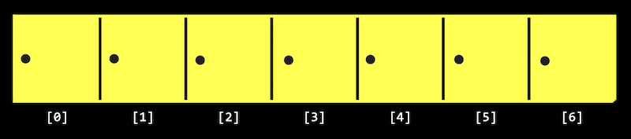

## Lecture 3
{:.no_toc}

* TOC
{:toc}

## Last week

* Recall that our purpose for learning a new programming language and other tools is to solve problems. And we solve those problems by creating some output from input:

  

* We learned about memory, which allows us to store data as bytes, and strings, which are arrays of characters.

## Searching

* Today we’ll focus on algorithms that solve problems with arrays.
* It turns out that, with arrays, a computer can’t look at all of the elements at once. Instead, a computer can only look at them one at a time, though we can look in any order, like only being able to open one locker at a time:

  

  * Recall that arrays are zero-indexed, meaning that the first item has an index of 0. And with $n$ items, the highest index would be $n - 1$.
* **Searching** is how we solve the problem of finding information. A simple problem has an input of some values, and an output of a `bool`, whether or not a particular value is in the array.

### Big $O$ 

* Today we’ll look at algorithms for searching. To compare their efficiency, we’ll consider **running time**, or how long an algorithm takes to run given some size of input.
* Computer scientists tend to describe running time with **big $O$ notation**, which we can think of as “on the order of” something, as though we want to convey an idea of running time and not an exact number of milliseconds or steps.
* In lecture 0, we saw a chart with different types of algorithms and the times they might take to solve a problem:

  

    * Recall that the red line is searching linearly, one page at a time; the yellow line is searching two pages at a time; and the green line is dividing and conquering, starting in the middle and dividing the problem in half each time.
* In the chart above, if we zoomed out and changed the units on our axes, we would see the red and yellow lines end up very close together:

  

  * So we use big $O$ notation to describe both the red and yellow lines, since they end up being very similar as $n$ becomes larger and larger. We would describe them both as having “big $O$ of $n$” or “on the order of $n$” running time.
  * The green line, though, is fundamentally different in its shape, even as $n$ becomes very large, so it takes “big $O$ of $\log n$” steps. (The base of the logarithm, 2, is also removed since it’s a constant factor.)
* We’ll see some common running times:
  * $O(n^2)$
  * $O(n \log n)$
  * $O(n)$
  * $O(\log n)$
  * $O(1)$
* Computer scientists might also use big $\Omega$, big Omega notation, which describes the lower bound of number of steps for our algorithm, or how few steps it might take, in the best case. Big $O$, on the order of, is the upper bound of number of steps, or how many steps it might take, in the worst case.
* We have a similar set of the most common big $\Omega$ running times:
  * $\Omega(n^2)$
  * $\Omega(n \log n)$
  * $\Omega(n)$
  * $\Omega(\log n)$
  * $\Omega(1)$ 
* Finally, there is another notation, $\Theta$, big Theta, which we use to describe running times of algorithms if the upper bound and lower bound is the same.
  * $\Theta(n^2)$
  * $\Theta(n \log n)$
  * $\Theta(n)$
  * $\Theta(\log n)$
  * $\Theta(1)$
* An algorithm with running time of $O(1)$ means that a constant number of steps is required, no matter how big the problem is.
* Let’s take a look at some algorithms that we can describe with these running times.

### Linear search, binary search

* On stage, we have seven lockers with closed doors, with numbers hidden behind them. Since a computer can only look at one element in an array at a time, we can only open one door at a time as well.
* If we want to look for the number zero, for example, we would have to open one door at a time, and if we didn’t know anything about the numbers behind the doors, the simplest algorithm would be going from left to right.
* This algorithm, **linear search**, would be correct but not very efficient. We might write pseudocode with:
    ```
    For each door from left to right
        If number is behind door
            Return true
    Return false
    ```
    * `Return false` is outside the for loop, since we only want to do that after we’ve looked behind all the doors.
* We can rewrite our pseudocode to be a little closer to C:
    ```
    For i from 0 to n-1
        If number behind doors[i]
            Return true
    Return false
    ```
  * Now, we’re using a variable, `i`, to look at each location in an array called `doors`.
* With `n` doors, we’ll need to look at all `n` of them. And what we do for each of the `n` doors, which is looking inside and possibly returning `true`, takes a constant number of steps each time. So the big $O$ running time for this algorithm would be $O(n)$.
* The lower bound, big Omega, would be $\Omega(1)$, since we might be lucky and find the number we’re looking for right away, which takes a constant number of steps.
* If we know that the numbers behind the doors are sorted, then we can start in the middle, and find our value more efficiently since we know we can go left or right, dividing the problem in half each time.
* For **binary search**, the pseudocode for our algorithm might look like:
    ```
    If no doors
        Return false
    If number behind middle door
        Return true
    Else if number < middle door
        Search left half
    Else if number > middle door
        Search right half
    ```
  * We remember to check whether there are no doors left, since that means our number isn’t behind any of them.
* We can write this pseudocode to be more like C:
    ```
    If no doors
        Return false
    If number behind doors[middle]
        Return true
    Else if number < doors[middle]
        Search doors[0] through doors[middle - 1]
    Else if number > doors[middle]
        Search doors [middle + 1] through doors[n - 1]
    ```
  * We can determine the index of the middle door with a bit of math, and then we can divide the problem into searching either the doors with indices `0` through `middle - 1`, or `middle + 1` through `n - 1`.
* The upper bound for binary search is $O(\log n)$, since we might have to keep dividing the number of doors by two until there are no more doors left. The lower bound $\Omega(1)$, if the number we’re looking for is in the middle, where we happen to start.
* Even though binary search might be much faster than linear search, it requires our array to be sorted first. If we’re planning to search our data many times, it might be worth taking the time to sort it first, so we can use binary search.
* Other resources we might consider beyond the time it takes to run some code include the time it takes to write the code, or the amount of memory required for our code.

### Searching with code

* Let’s take a look at `numbers.c`:
    ```c
    #include <cs50.h>
    #include <stdio.h>

    int main(void)
    {
        int numbers[] = {4, 6, 8, 2, 7, 5, 0};

        for (int i = 0; i < 7; i++)
        {
            if (numbers[i] == 0)
            {
                printf("Found\n");
                return 0;
            }
        }
        printf("Not found\n");
        return 1;
    }
    ```
  * Here we initialize an array with values by using curly braces, and we check the items in the array one at a time, in order, to see if they’re equal to zero.
  * If we find the value of zero, we return an exit code of 0 (to indicate success). Otherwise, after our for loop, we call return 1 (to indicate an error code).
  * This is how we might implement linear search.
  * We can compile our program and run it to see that it works:
    ```
    $ make numbers
    $ ./numbers
    Found
    ```
And we can change what we’re looking for to -1, and see that our program doesn’t find it:
...
if (numbers[i] == -1)
...
$ make numbers
$ ./numbers
Not found
We can do the same for strings in names.c:
#include <cs50.h>
#include <stdio.h>
#include <string.h>

int main(void)
{
    string names[] = {"Bill", "Charlie", "Fred", "George", "Ginny", "Percy", "Ron"};

    for (int i = 0; i < 7; i++)
    {
        if (names[i] == "Ron")
        {
            printf("Found\n");
            return 0;
        }
    }
    printf("Not found\n");
    return 1;
}
But when we try to compile our program, we get:
$ make names
names.c:11:22: error: result of comparison against a string literal is unspecified (use an explicit string comparison function instead) [-Werror,-Wstring-compare]
        if (names[i] == "Ron")
                     ^  ~~~~~
1 error generated.
make: *** [<builtin>: names] Error 1
It turns out that we can’t compare strings directly in C, since they’re not a simple data type built into the language, but rather an array of many characters. Luckily, the string library has function, strcmp, string compare, which compares strings for us. strcmp returns a negative value if the first string comes before the second string, 0 if the strings are the same, and a positive value if the first string comes after the second string.
We’ll change our conditional to if (strcmp(names[i], "Ron") == 0), so we can check whether our two strings are actually equal.
And if we wrote if (strcmp(names[i], "Ron")), then any non-zero value, positive or negative, would be considered true, which would be the opposite of what we want.
We could actually write if (!strcmp(names[i], "Ron")) to invert the value, which would work in this case, but it would be arguably worse design since it doesn’t explicitly check for the value of 0 as the documentation indicates.