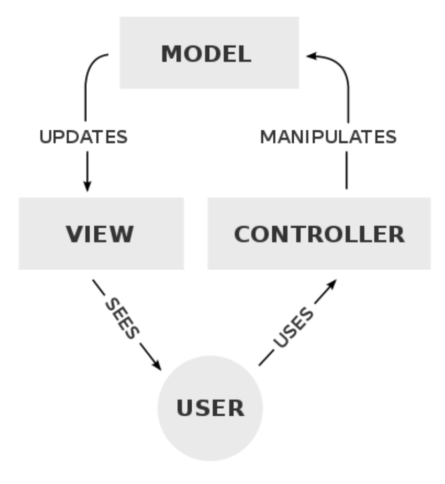
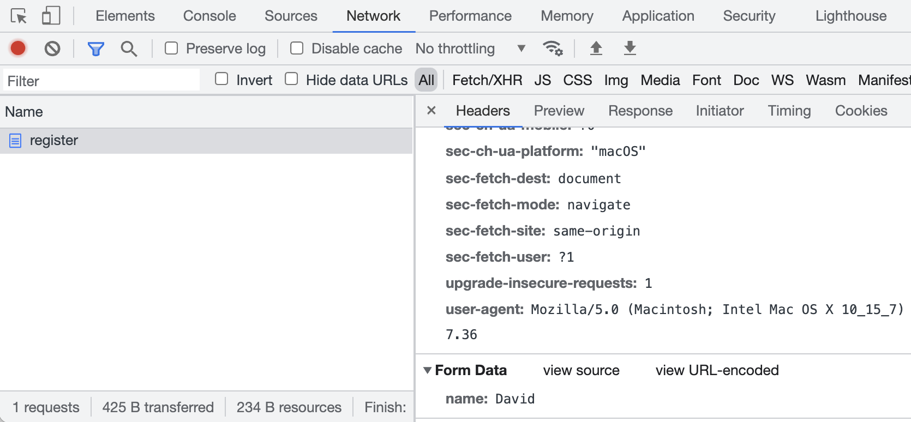


# Lecture 9
{:.no_toc}

* TOC
{:toc}

## Web programming

* Today, we’ll use all the tools and technologies we’ve learned to build applications for the web.
* In the last unit, we used `http-server` as a web server in VS Code. This program listens for connections and requests, and responds with static content, like HTML files and images. But `http-server` can’t process other types of requests, like form inputs from the user.
* Recall that a URL might look like `http://www.example.com/`, for the site’s default page, or `http://www.example.com/file.html` for a specific file. A file might be in a folder, like `folder/file.html`, and that reference is known as a **path**. A path can also be called a **route**, which does not need to refer to an actual file.
* A URL can also include form inputs, like:
    ```
    http://www.example.com/route?key=value
    ```
* An HTTP request for a route with inputs might look like:
    ```
    GET /search?q=cats HTTP/1.1
    Host: www.google.com
    ...
    ```
    * Now, we need a web server that can **parse**, or analyze, HTTP request headers and return different pages based on the route.

## Flask

* We’ll use Python and a library called **Flask** to write our own web server.
* Flask is also a **framework**, where the library of code also comes with a set of conventions for how it should be used. For example, like other libraries, Flask includes functions we can use to parse requests individually, but as a framework, also requires our program’s code to be organized in a certain way:
    ```python
    app.py
    requirements.txt
    static/
    templates/
    ```
    * `app.py` will have the Python code for our web server.
    * `requirements.py` includes a list of required libraries for our application.
    * `static/` is a directory of static files, like images and CSS and JavaScript files.
    * `templates/` is a directory for HTML files that will form our pages.
* Other web server frameworks will have a different set of conventions and requirements.
* Let’s write a simple web server by creating an `app.py` in VS Code:
    ```python
    from flask import Flask, render_template, request

    app = Flask(__name__)


    @app.route("/")
    def index():
        return render_template("index.html")
    ```
    * First, we’ll import `Flask` from the `flask` library, along with some other functions.
    * Then, we’ll create an `app` variable by giving our Python file’s name to the `Flask` variable.
    * Next, we’ll label a function for the `/` route with `@app.route` from Flask. The `@` symbol in Python is called a **decorator**, which modifies a function.
    * Finally, our `index()` function will just render a template, or return HTML code, from the file `index.html`.
* Now, we’ll need to create a `templates/` directory, and create an `index.html` file with some content inside it:
    ```
    <!DOCTYPE html>
    
    <html lang="en">
        <head>
            <meta name="viewport" content="initial-scale=1, width=device-width">
            <title>hello</title>
        </head>
        <body>
            hello, world
        </body>
    </html>
    ```
* Now, typing `flask run` will return that HTML file when we visit our server’s URL:
    ```bash
    $ flask run
    * Environment: development
    * Debug mode: off
    * Running on https://student50-code50-5000.githubpreview.dev/
    (Press CTRL+C to quit)
    * Restarting with stat
    ```
* We can change the URL by adding `/?name=David`, but our page stays the same. We’ll need to change our code in `app.py`:
    ```python
    from flask import Flask, render_template, request

    app = Flask(__name__)


    @app.route("/")
    def index():
        name = request.args.get("name")
        return render_template("index.html", name=name)
    ```
    * We can use the `request` variable from the Flask library to get the arguments from the request. Then, we can pass in the `name` variable as an argument to the `render_template` function.
* In our HTML file, we can include that variable with two curly braces:
    ```
    <!DOCTYPE html>

    <html lang="en">
        <head>
            <meta name="viewport" content="initial-scale=1, width=device-width">
            <title>hello</title>
        </head>
        <body>
            hello, {{ name }}
        </body>
    </html>
    ```
* Now, if we visit our URL with our input, we’ll see that the page’s content now includes it.
* To make sure our templates are reloaded, we can press `control` and `C` in the terminal window to exit Flask, and restart our server with `flask run` again.

## Forms

* In `index.html`, we’ll create a form:
    ```
    <!DOCTYPE html>

    <html lang="en">
        <head>
            <meta name="viewport" content="initial-scale=1, width=device-width">
            <title>hello</title>
        </head>
        <body>
            <form action="/greet" method="get">
                <input autocomplete="off" autofocus name="name" placeholder="Name" type="text">
                <input type="submit">
            </form>
        </body>
    </html>
    ```
    * We’ll send the form to the `/greet` route, and have an input for the `name` parameter as well as a submit button.
* Now, when we refresh our page and submit the form, we see that the URL has changed to something like `/greet?name=David`, and a page that says “Not Found”.
* In `app.py`, we’ll need to add a function for the `/greet` route with what we had in the `index()` function before:
    ```python
    @app.route("/")
    def index():
        return render_template("index.html")


    @app.route("/greet")
    def greet():
        name = request.args.get("name")
        return render_template("greet.html", name=name)
    ```
    * Meanwhile, our `index()` function will just return the `index.html` page with the form.
* When we submit our form this time, we see an “Internal Server Error” on the page. We can go back to our terminal window where `flask run` will show more details:
    ```
    [2021-11-10 00:17:18,559] ERROR in app: Exception on /greet [GET]
    Traceback (most recent call last):
    ...
    File "/usr/local/lib/python3.10/site-packages/flask/templating.py", line 89, in _get_source_fast
        raise TemplateNotFound(template)
    jinja2.exceptions.TemplateNotFound: greet.html
    127.0.0.1 - - [8/Nov/2021 19:05:28] "GET /greet?name=David HTTP/1.0" 500 -
    ```
    We see that the request was indeed for the correct route, but it appears that Flask couldn’t find the template called `greet.html`.
* We’ll have to create a new file in `templates` called `greet.html` and use the `name` variable as before:
    ```
    <!DOCTYPE html>

    <html lang="en">
        <head>
            <meta name="viewport" content="initial-scale=1, width=device-width">
            <title>hello</title>
        </head>
        <body>
            hello, {{ name }}
        </body>
    </html>
    ```
* Now, if we restart our server, we can see our form at the default page, and use the input from the user to generate another page from a template.
* It turns out that the `get` function allows for a default value, so we can write:
    ```python
    @app.route("/greet")
    def greet():
        name = request.args.get("name", "world")
        return render_template("greet.html", name=name)
    ```
    * Now, if someone visits our URL with just `/greet`, the name variable will be set to world by default.
* But, if someone uses our form and provides no input, the URL becomes `/greet?name=`, and `name` will actually have a value of a blank string. We can add the `required` attribute to our form in `index.html`, but we can’t rely on that safety check, since, as we saw last week, anyone can change our page on the client-side with Developer Tools in the browser.

## Layouts

* In `index.html` and `greet.html`, we have some repeated HTML code. With just HTML, we aren’t able to share code between files, but with Flask templates (and other web frameworks), we can factor out such common content.
* We’ll create another template, `layout.html`:
    ```
    <!DOCTYPE html>

    <html lang="en">
        <head>
            <title>hello</title>
        </head>
        <body>
            
        </body>
    </html>
    ```
    * With the `` syntax, we can include placeholder blocks, or other chunks of code. Here we’ve named our block `body` since it contains the HTML that should go in the `<body>` element.
* In `index.html`, we’ll use the `layout.html` blueprint and only define the `body` block with:
    ```
    

    

        <form action="/greet" method="post">
            <input autocomplete="off" autofocus name="name" placeholder="Name" type="text">
            <input type="submit">
        </form>

    
    ```
    * Now, we can have just our `<form>` element in `index.html`. The template code, in ``, indicates to Flask that we want `index.html` to use another template, `layout.html`, and substitute this code in the `` placeholder.
* Similarly, in `greet.html`, we define the body block with just the greeting:
    ```
    

    

        hello, {{ name }}

    
    ```
    * The templating language is actually called Jinja, and understood by Flask.
* Now, if we restart our server, and view the source of our HTML after opening our server’s URL, we see a complete page with our form inside our HTML file, generated by Flask:
    ```
    <!DOCTYPE html>

    <html lang="en">
        <head>
            <meta name="viewport" content="initial-scale=1, width=device-width">
            <title>hello</title>
        </head>
        <body>


        <form action="/greet" method="get">
            <input autocomplete="off" autofocus name="name" placeholder="Name" type="text">
            <input type="submit">
        </form>


        </body>
    </html>
    ```
    * Our indentation is no longer perfect, but that’s acceptable since now our source code has the proper indentation, and Flask is using that to generate the page.
* Since our HTML pages are now generated by logic in code, we’ve built a **web application**.

## POST

* Our form above used the GET method, which includes our form’s data in the URL.
* We’ll just need to change the `method` in our HTML form: `<form action="/greet" method="post">`.
* Now, when we visit our form and submit it, we see another error, “Method Not Allowed”.
* Our controller will also need to be changed to accept the POST method, and look for the input from the form:
    ```python
    @app.route("/greet", methods=["POST"])
    def greet():
        return render_template("greet.html", name=request.form.get("name", "world"))
    ```
    * While `request.args` is for inputs from a GET request, we have to use `request.form` in Flask for inputs from a POST request.
* Now, when we restart our application after making these changes, we can see that the form takes us to `/greet`, but the contents aren’t included in the URL anymore.
* Note that when we reload the `/greet page`, the browser asks us to confirm the form submission, since it’s temporarily remembering the inputs.
* GET requests are useful since they allow the browser to save the contents of the form in history, and allow links that include information as well, like [https://www.google.com/search?q=what+time+is+it](https://www.google.com/search?q=what+time+is+it).

## MVC

* The Flask framework implements a particular **paradigm**, or way of thinking and programming. This paradigm, also implemented by other frameworks, is known as **MVC**, or Model–view–controller:

    

    * The controller contains our “business logic”, code that manages our application overall, given user input. In Flask, this will be our Python code in `app.py`.
    * The view includes templates and visuals for the user interface, like the HTML and CSS that the user will see and interact with.
    * The model is our application’s data, such as a SQL database or CSV file, which we haven’t yet used.

## Frosh IMs

* One of David’s first web applications was for students on campus to register for “frosh IMs”, intramural sports:

    

* We’ll use a `layout.html` similar to what we had before:
    ```
    <!DOCTYPE html>

    <html lang="en">
        <head>
            <meta name="viewport" content="initial-scale=1, width=device-width">
            <title>froshims</title>
        </head>
        <body>
            
        </body>
    </html>
    ```
* In our `app.py`, we’ll return our `index.html` template for the default `/` route:
    ```python
    from flask import Flask, render_template, request

    app = Flask(__name__)


    @app.route("/")
    def index():
        return render_template("index.html")
    ```
* Our `index.html` template will look like this:
    ```
    

    
        
        TODO

    
    ```
* We’ll run our server and load the page just to see that everything is working so far.
* Let’s add a form to the `index.html` template:
    ```
    

    
        <h1>Register</h1>
        <form action="/register" method="post">
            <input autocomplete="off" autofocus name="name" placeholder="Name" type="text">
            <select>
                <option disabled selected>Sport</option>
                <option value="Basketball">Basketball</option>
                <option value="Soccer">Soccer</option>
                <option value="Ultimate Frisbee">Ultimate Frisbee</option>
            </select>
            <input type="submit" value="Register">
        </form>
    
    ```
    * We’ll plan to have a `/register` route, and have a `<select>` menu, which looks like a dropdown menu with options for each sport.
* In `app.py`, we’ll allow POST for our `/register` route:
    ```python
    @app.route("/register", methods=["POST"])
    def register():

        # Validate submission
        if not request.form.get("name") or request.form.get("sport") not in ["Basketball", "Soccer", "Ultimate Frisbee"]:
            return render_template("failure.html")

        # Confirm registration
        return render_template("success.html")
    ```
    * We’ll check that our form’s values are valid, and then return a template for either failure or success depending on the results.
* `failure.html` will have:
    ```
    

    
        You are not registered!
    
    ```
* And `success.html` will have:
    ```
    

    
        You are registered!
    
    ```
* Notice that our application doesn’t actually save the data anywhere yet.
* When we run this application, though, we see that we are not registered, even if we fill out the form.
* We can open the Developer Tools in Chrome, using the Network tab like we did in the last unit, and submit our form again to see the request our browser actually made:

    

    * At the very bottom, we see that the form data only has `name: David`.
* It turns out that our `<select>` input needs a name of `sport` to be sent to the server:
    ```
    

    
        <h1>Register</h1>
        <form action="/register" method="post">
            <input autocomplete="off" autofocus name="name" placeholder="Name" type="text">
            <select name="sport">
                <option disabled selected>Sport</option>
                <option value="Basketball">Basketball</option>
                <option value="Soccer">Soccer</option>
                <option value="Ultimate Frisbee">Ultimate Frisbee</option>
            </select>
            <input type="submit" value="Register">
        </form>
    
    ```
    * Now our server will be able to get the input with `request.form.get("sport")`.
* We can also link to CSS in `layout.html`:
    ```
    <!DOCTYPE html>

    <html lang="en">
        <head>
            <meta name="viewport" content="initial-scale=1, width=device-width">
            <link href="/static/styles.css" rel="stylesheet">
            <title>froshims</title>
        </head>
        <body>
            
        </body>
    </html>
    ```
    By Flask’s convention, we’ll have a directory called `static` for files like images and CSS.
* We can improve the design of our application by having a single list of sports:
    ```python
    from flask import Flask, render_template, request

    app = Flask(__name__)

    SPORTS = [
        "Basketball"
        "Soccer",
        "Ultimate Frisbee"
    ]


    @app.route("/")
    def index():
        return render_template("index.html", sports=SPORTS)

    ...
    ```
    * Then, we’ll pass that list into the `index.html` template.
* In our template, we can use a loop to generate a list of options from the list of strings passed in as `sports`:
    ```
    ...
    <select name="sport">
        <option disabled selected value="">Sport</option>
        
            <option value="{{ sport }}">{{ sport }}</option>
        
    </select>
    ...
    ```
    * The `for` and `endfor` syntax creates a loop, and now we can programmatically create an `<option>` element for each sport in our list.
* Finally, we can check that the `sport` sent in the POST request is in the list `SPORTS` in `app.py`:
    ```python
    ...
    @app.route("/register", methods=["POST"])
    def register():

        if not request.form.get("name") or request.form.get("sport") not in SPORTS:
            return render_template("failure.html")

        return render_template("success.html")
    ```
    * Now, to add another sport, we only need to change the `SPORTS` list.
* We can change the select menu in our form to be checkboxes, to allow for multiple sports:
    ```
    

    
        <h1>Register</h1>

        <form action="/register" method="post">

            <input autocomplete="off" autofocus name="name" placeholder="Name" type="text">
            
                <input name="sport" type="checkbox" value="{{ sport }}"> {{ sport }}
            
            <input type="submit" value="Register">

        </form>
    
    ```
    * We’ll make sure that each `input` has the value of the sport, so it can be sent to the server, and also the sport printed next to it, so the user can see it.
    * Back in our `register` function in app.py, we can use another function to get the list of checked options.
* We can also use radio buttons, which will allow only one option to be chosen at a time with `<input name="sport" type="radio" value="{{ sport }}"> {{ sport }}`.

## Storing data

* Let’s look at how we might store our registered students in a dictionary in the memory of our web server with [`froshims3`](https://cdn.cs50.net/2021/fall/lectures/9/src9/froshims3/):
    ```python
    # Implements a registration form, storing registrants in a dictionary, with error messages

    from flask import Flask, redirect, render_template, request

    app = Flask(__name__)

    REGISTRANTS = {}

    SPORTS = [
        "Basketball",
        "Soccer",
        "Ultimate Frisbee"
    ]


    @app.route("/")
    def index():
        return render_template("index.html", sports=SPORTS)


    @app.route("/register", methods=["POST"])
    def register():

        # Validate name
        name = request.form.get("name")
        if not name:
            return render_template("error.html", message="Missing name")

        # Validate sport
        sport = request.form.get("sport")
        if not sport:
            return render_template("error.html", message="Missing sport")
        if sport not in SPORTS:
            return render_template("error.html", message="Invalid sport")

        # Remember registrant
        REGISTRANTS[name] = sport

        # Confirm registration
        return redirect("/registrants")


    @app.route("/registrants")
    def registrants():
        return render_template("registrants.html", registrants=REGISTRANTS)
    ```
    * We’ll create a dictionary called `REGISTRANTS`, and in `register` we’ll first check the `name` and `sport`, returning a different error message in each case with `error.html`. Then, we can store the name and sport in our `REGISTRANTS` dictionary, and redirect to another route that will display registered students.
* The error message template, meanwhile, will display the error message along with a fun image of a grumpy cat:
    ```
    

    
        <h1>Error</h1>
        <p>{{ message }}</p>
        
    
    ```
* Our `registrants.html` template will print a table with the dictionary passed in as input:
    ```
    

    
        <h1>Registrants</h1>
        <table>
            <thead>
                <tr>
                    <th>Name</th>
                    <th>Sport</th>
                </tr>
            </thead>
            <tbody>
                
                    <tr>
                        <td>{{ name }}</td>
                        <td>{{ registrants[name] }}</td>
                    </tr>
                
            </tbody>
        </table>
    
    ```
    Our table has a header row, and then a row for each key and value stored in `registrants`.
* If our web server stops running, we’ll lose the data stored in memory, so we’ll use a SQLite database with the SQL library from `cs50` in [`froshims4`](https://cdn.cs50.net/2021/fall/lectures/9/src9/froshims4/):
    ```python
    # Implements a registration form, storing registrants in a SQLite database, with support for deregistration

    from cs50 import SQL
    from flask import Flask, redirect, render_template, request

    app = Flask(__name__)

    db = SQL("sqlite:///froshims.db")

    SPORTS = [
        "Basketball",
        "Soccer",
        "Ultimate Frisbee"
    ]


    @app.route("/")
    def index():
        return render_template("index.html", sports=SPORTS)

    ...
    ```
    * In our terminal, we can run `sqlite3 froshims.db` to open the database, and use the `.schema` command to see the table with columns of `id`, `name`, and `sport`, which was created in advance:
        ```
        src9/froshims4/ $ sqlite3 froshims.db
        SQLite version 3.36.0 2021-06-18 18:36:39
        Enter ".help" for usage hints.
        sqlite> .schema
        CREATE TABLE registrants (id INTEGER, name TEXT NOT NULL, sport TEXT NOT NULL, PRIMARY KEY(id));
        ```
* Now, in our `/register` route, we’re using SQL to store our data:
    ```python
    @app.route("/register", methods=["POST"])
    def register():

        # Validate submission
        name = request.form.get("name")
        sport = request.form.get("sport")
        if not name or sport not in SPORTS:
            return render_template("failure.html")

        # Remember registrant
        db.execute("INSERT INTO registrants (name, sport) VALUES(?, ?)", name, sport)

        # Confirm registration
        return redirect("/registrants")
    ```
    * Once we’ve validated the request, we can use `INSERT INTO` to add a row.
    * Flask also includes a function, `redirect`, that we can use to redirect to another route.
* Similarly, for the `/registrants` route, we can `SELECT` all rows and pass them to the template as a list of rows:
    ```python
    @app.route("/registrants")
    def registrants():
        registrants = db.execute("SELECT * FROM registrants")
        return render_template("registrants.html", registrants=registrants)
    ```
* Our `registrants.html` template will use `registrant["name"]` and `registrant["sport"]` to access the value of each key in each row:
    ```
    

    
        <h1>Registrants</h1>
        <table>
            <thead>
                <tr>
                    <th>Name</th>
                    <th>Sport</th>
                    <th></th>
                </tr>
            </thead>
            <tbody>
                
                    <tr>
                        <td>{{ registrant["name"] }}</td>
                        <td>{{ registrant["sport"] }}</td>
                        <td>
                            <form action="/deregister" method="post">
                                <input name="id" type="hidden" value="{{ registrant.id }}">
                                <input type="submit" value="Deregister">
                            </form>
                        </td>
                    </tr>
                
            </tbody>
        </table>
    
    ```
    * Our page will include another form for deregistering a person by an `id`. When we click that button, we’ll see a request that just sends the `id` to our `/deregister` route.
* We’ll register a few people, and go back into our terminal to see that our database now has a few rows:
    ```
    $ sqlite3 froshims.db
    SQLite version 3.36.0 2021-06-18 18:36:39
    Enter ".help" for usage hints.
    sqlite> SELECT * FROM registrants;
    +----+--------+------------------+
    | id |  name  |      sport       |
    +----+--------+------------------+
    | 1  | David  | Ultimate Frisbee |
    | 2  | Carter | Basketball       |
    | 3  | Emma   | Soccer           |
    +----+--------+------------------+
    ```
* Our `/deregister` route will take an `id` and delete that row from our database:
    ```python
    @app.route("/deregister", methods=["POST"])
    def deregister():

        # Forget registrant
        id = request.form.get("id")
        if id:
            db.execute("DELETE FROM registrants WHERE id = ?", id)
        return redirect("/registrants")
    ```
* A URL that uses GET can also be used to trick people, since they might click on them while logged in to a website, and perform some action unintentionally, known as a [**cross-site request forgery**](https://en.wikipedia.org/wiki/Cross-site_request_forgery).

## Emails

* We can even email users with another library, `flask_mail`, in [`froshims5`](https://cdn.cs50.net/2021/fall/lectures/9/src9/froshims5/):
    ```python
    # Implements a registration form, confirming registration via email

    import os
    import re

    from flask import Flask, render_template, request
    from flask_mail import Mail, Message

    app = Flask(__name__)

    # Requires that "Less secure app access" be on
    # https://support.google.com/accounts/answer/6010255
    app.config["MAIL_DEFAULT_SENDER"] = os.environ["MAIL_DEFAULT_SENDER"]
    app.config["MAIL_PASSWORD"] = os.environ["MAIL_PASSWORD"]
    app.config["MAIL_PORT"] = 587
    app.config["MAIL_SERVER"] = "smtp.gmail.com"
    app.config["MAIL_USE_TLS"] = True
    app.config["MAIL_USERNAME"] = os.environ["MAIL_USERNAME"]
    mail = Mail(app)

    ...
    ```
    * It turns out that we can provide configuration details like a username and password and mail server, in this case Gmail’s, to the `Mail` variable, which will send mail for us.
    * We set the sensitive variables outside of our source code, in VS Code’s environment, so we can avoid including them in our code.
* In our `register` route, we send an email to the user with the `mail.send()` function from the `flask_mail` library:
    ```python
    @app.route("/register", methods=["POST"])
    def register():

        # Validate submission
        name = request.form.get("name")
        email = request.form.get("email")
        sport = request.form.get("sport")
        if not name or not email or sport not in SPORTS:
            return render_template("failure.html")

        # Send email
        message = Message("You are registered!", recipients=[email])
        mail.send(message)

        # Confirm registration
        return render_template("success.html")
    ```
* To include the libraries we need, we’ll write a `requirements.txt` file with:
    ```
    Flask
    Flask-Mail
    ```
* Now, if we restart our server and use the form to provide an email, we’ll see that we indeed get one sent to us (though it may end up in the Spam folder if we send too many to the same address)!

## Sessions

* **Sessions** are how web servers remember information about each user, which enables features like allowing users to stay logged in, and saving items to a shopping cart. These features require our server to be **stateful**, or having access to additional state, or information. HTTP on its own is **stateless**, since after we make a request and get a response, the interaction is completed.
* It turns out that servers can send another header in a response, called `Set-Cookie`:
    ```
    HTTP/1.1 200 OK
    Content-Type: text/html
    Set-Cookie: session=value
    ...
    ```
    * **Cookies** are small pieces of data from a web server that the browser saves for us. In many cases, they are large random numbers or strings used to uniquely identify and track a user between visits.
    * In this case, the server is asking our browser to set a cookie for that server, called `session` to a value of `value`.
* Then, when the browser makes another request to the same server, it’ll send back the same cookie that the same server has set before:
    ```
    GET / HTTP/1.1
    Host: gmail.com
    Cookie: session=value
    ```
* In the real world, amusement parks might give you a hand stamp so you can come back inside after leaving. Similarly, our browser is presenting our cookies back to the web server, so it can remember who we are.
* In Flask, we can use the `flask_session` library to help manage this for us, in a new app called [`login`](https://cdn.cs50.net/2021/fall/lectures/9/src9/login/):
    ```python
    from flask import Flask, redirect, render_template, request, session
    from flask_session import Session

    # Configure app
    app = Flask(__name__)

    # Configure session
    app.config["SESSION_PERMANENT"] = False
    app.config["SESSION_TYPE"] = "filesystem"
    Session(app)
    ```
    * We’ll configure the session library to use the server’s filesystem, and use `session` like a dictionary to store a user’s name. It turns out that Flask will use HTTP cookies for us, to maintain this `session` variable for each user visiting our web server. Every user will be logged in with a different session, and we can see them in the `flask_session` directory:
        ```
        src9/login/flask_session/ $ ls
        2029240f6d1128be89ddc32729463129
        ```
* We’ll visit our server’s URL, and get redirected to the `/login` route automatically. We see a form that we can fill in, and then redirected back to the index route, `/`, with “You are logged in as David.” Then, we can reload the page, or open it again in a new tab, and see the same message. We can also use the “Log out” link to log out.
* For our default `/` route, we’ll redirect to `/login` if there’s no name set in `session` for the user yet, and otherwise show a default `index.html` template.
    ```python
    @app.route("/")
    def index():
        if not session.get("name"):
            return redirect("/login")
        return render_template("index.html")
    ```
* In our `index.html`, we can check if `session["name"]` exists, and show different content if so:
    ```
    

    

        
            You are logged in as {{ session["name"] }}. <a href="/logout">Log out</a>.
        
            You are not logged in. <a href="/login">Log in</a>.
        

    
    ```
* For our `/login` route, we’ll store `name` in `session` to the form’s value sent via POST, and then redirect to the default route. If we visited the route via GET, we’ll render the login form at `login.html`:
    ```python
    @app.route("/login", methods=["GET", "POST"])
    def login():
        if request.method == "POST":
            session["name"] = request.form.get("name")
            return redirect("/")
        return render_template("login.html")
    ```
    * Then, in our login.html, we can have a form that can submit to itself:
        ```
        

        

            <form action="/login" method="post">
                <input autocomplete="off" autofocus name="name" placeholder="Name" type="text">
                <input type="submit" value="Log In">
            </form>

        
        ```
* For the `/logout` route, we can clear the value for `name` in `session` by setting it to `None`, and redirect to `/` again:
    ```python
    @app.route("/logout")
    def logout():
        session["name"] = None
        return redirect("/")
    ```

## store, shows

* We’ll look through another example, [`store`](https://cdn.cs50.net/2021/fall/lectures/9/src9/store/). When we run our server and visit our site’s URL, we see a list of books we can add to a virtual shopping cart.
* In the template `books.html`, we see another loop for each book:
    ```
    

    

        <h1>Books</h1>
        
            <h2>{{ book["title"] }}</h2>
            <form action="/cart" method="post">
                <input name="id" type="hidden" value="{{ book['id'] }}">
                <input type="submit" value="Add to Cart">
            </form>
        

    
    ```
    * Notice that each `<form>` includes a hidden value of `book['id']`. When the button “Add to Cart” is clicked, that ID is sent back to the server.
* In `app.py`, we see that there’s a database used to get the list of books:
    ```python
    ...
    # Connect to database
    db = SQL("sqlite:///store.db")
    ...
    @app.route("/")
    def index():
        books = db.execute("SELECT * FROM books")
        return render_template("books.html", books=books)
    ...
    ```
* As before, we can open the database to see its schema and data:
    ```
    src9/store/ $ sqlite3 store.db
    .SQLite version 3.36.0 2021-06-18 18:36:39
    Enter ".help" for usage hints.
    sqlite> .schema
    CREATE TABLE books (id INTEGER, title TEXT NOT NULL, PRIMARY KEY(id));
    sqlite> SELECT * FROM books;
    +----+-------------------------------------------+
    | id |                   title                   |
    +----+-------------------------------------------+
    | 1  | Harry Potter and the Sorcerer's Stone     |
    | 2  | Harry Potter and the Chamber of Secrets   |
    | 3  | Harry Potter and the Prisoner of Azkaban  |
    | 4  | Harry Potter and the Goblet of Fire       |
    | 5  | Harry Potter and the Order of the Phoenix |
    | 6  | Harry Potter and the Half-Blood Prince    |
    | 7  | Harry Potter and the Deathly Hallows      |
    +----+-------------------------------------------+
    ```
* In the `/cart` route, we’ll create a cart for the session automatically, and add values to it:
    ```python
    @app.route("/cart", methods=["GET", "POST"])
    def cart():

        # Ensure cart exists
        if "cart" not in session:
            session["cart"] = []

        # POST
        if request.method == "POST":
            id = request.form.get("id")
            if id:
                session["cart"].append(id)
            return redirect("/cart")

        # GET
        books = db.execute("SELECT * FROM books WHERE id IN (?)", session["cart"])
        return render_template("cart.html", books=books)
    ```
    * Our route can accept either a form input via POST, or a request via POST to shows the contents of the cart. We can add this check with `if request.method == "POST":`.
    * When we receive a form input, we can add it to our list of IDs in memory with `session["cart"].append(id)`.
    * When we receive a GET request, we can pass that list of IDs to our database to retrieve the names of the books.

## Searching

*Let’s look at another example, [`shows0`](https://cdn.cs50.net/2021/fall/lectures/9/src9/shows0/).
* When we run our server and visit the page, we see a search form that allows us to search for titles of TV shows. Our URL changes to `/search?q=cats`.
* In `app.py`, we start by opening a database, `shows.db`:
    ```python
    # Searches for shows

    from cs50 import SQL
    from flask import Flask, render_template, request

    app = Flask(__name__)

    db = SQL("sqlite:///shows.db")


    @app.route("/")
    def index():
        return render_template("index.html")


    @app.route("/search")
    def search():
        shows = db.execute("SELECT * FROM shows WHERE title LIKE ?", "%" + request.args.get("q") + "%")
        return render_template("search.html", shows=shows)
    ```
    * The default `/` route will show a form, where we can type in some search term.
    * The form will use the GET method to send the search query to `/search`, which in turn will use SQL to find a list of shows that match.
    * Finally, the `search.html` template will use a loop to print the list of show titles:
        ```
        

        

            <ul>
                
                    <li>{{ show["title"] }}</li>
                
            </ul>

        
        ```
* With JavaScript in [`shows1`](https://cdn.cs50.net/2021/fall/lectures/9/src9/shows1/), we can show a partial list of results as we type.
* If we look at the source code of our page, we see that there’s JavaScript that sets the HTML of an empty `<ul>`.
    ```
    <!DOCTYPE html>

    <html lang="en">
        <head>
            <meta name="viewport" content="initial-scale=1, width=device-width">
            <title>shows</title>
        </head>
        <body>

            <input autocomplete="off" autofocus placeholder="Query" type="search">

            <ul></ul>

            <script>
        
                let input = document.querySelector('input');
                input.addEventListener('input', async function() {
                    let response = await fetch('/search?q=' + input.value);
                    let shows = await response.text();
                    document.querySelector('ul').innerHTML = shows;
                });

            </script>

        </body>
    </html>
    ```
    * In our JavaScript code, we start by selecting the input box. Then, every time the input changes, we use a function called `fetch` to get more data from the server without changing the URL of the current page. Here, we’re using the `/search` route.
    * Then, we store the text of the response in a variable called `shows`, and then using that in our HTML.
    * We can use the Network tab in Developer Tools again, to see that the response of the `/search` route is a list of `<li>` elements.
    * We can even visit `/search?q=c` manually to see the same response in our browser:
        ```

        <li>Catweazle</li>

        <li>Ace of Wands</li>

        <li>The Adventures of Don Quick</li>

        <li>Albert and Victoria</li>

        <li>All My Children</li>
            
        ...
        ```
* It turns out that we can use another format for our data, JSON, JavaScript Object Notation in [`shows2`](https://cdn.cs50.net/2021/fall/lectures/9/src9/shows2/), instead of returning a long list of `<li>` elements that are already created. Now, when we run this version and visit the same URL, we see:
    ```
    [{"id":63881,"title":"Catweazle"},{"id":65269,"title":"Ace of Wands"},{"id":65270,"title":"The Adventures of Don Quick"},{"id":65271,"title":"Albert and Victoria"},{"id":65272,"title":"All My Children"},...
    ```
    * We see a more efficient notation, that includes the raw data of an `id` and `title` for each show.
* Then, in the source code of our `index.html`, we’ll use JavaScript to add those shows to our page programmatically:
    ```
    <!DOCTYPE html>

    <html lang="en">
        <head>
            <meta name="viewport" content="initial-scale=1, width=device-width">
            <title>shows</title>
        </head>
        <body>

            <input autocomplete="off" autofocus placeholder="Query" type="text">

            <ul></ul>

            <script>
        
                let input = document.querySelector('input');
                input.addEventListener('input', async function() {
                    let response = await fetch('/search?q=' + input.value);
                    let shows = await response.json();
                    let html = '';
                    for (let id in shows) {
                        let title = shows[id].title.replace('<', '&lt;').replace('&', '&amp;');
                        html += '<li>' + title + '</li>';
                    }
                    document.querySelector('ul').innerHTML = html;
                });

            </script>

        </body>
    </html>
    ```
    * With `response.json()`, we turn the raw response into a list of dictionaries, and then we can build a string of HTML with the `for` loop.
* So, in this web application, HTML is used to for the view itself, Python is used to write the code on our server that sends back data, and JavaScript is used to make the page interactive and dynamic.
