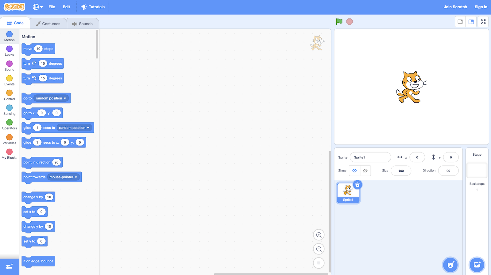

# Programming
{:.no_toc}

* TOC
{:toc}

## Introduction

* David plays a game called Oscartime that was the first Scratch program he created
* Scratch is a graphical programming language created by MIT’s Lifelong Kindergarten Group
* The language not only helps get kids excited about programming, but it’s also very instructive

## Software

* Programing is ultimately about making software
    * Software is what runs on our hardware
        * Could run on a desktop, or phone, etc.

## Finding Mike Smith

* Code is just a technical implementation of algorithms
    * Algorithms are step by step instructions for solving problems
* Consider a phonebook full of thousands of names and phone numbers
* How do we lookup someone like Mike Smith?
    * We could start at the first page, move to the next, and so on until we find him
        * This is a correct algorithm, as we will find Mike Smith eventually
        * However, it’s inefficient
    * We could start at the first page and count by 2s
        * I would find Mike Smith twice as quickly
        * However, this alone is not correct as we could miss Mike Smith if his name is sandwiched between two pages
        * We could fix this by checking the previous page if we go past where Mike Smith should be
* More likely, we’d probably go to the middle of the phonebook and find ourselves in the “M” section
    * As Smith is after M, he must be in the latter (right) half of the book
        * We can ignore the other half
    * After removing the other half, we are left with half of the book, representing the same problem we started with fundamentally
        * We can keep repeating this process until we’re down to one page with Mike’s number on it
    * This leverages the fact that the book is sorted alphabetically
    * We are deviding and conquering
        * 1000 pages → 500 pages → 250 pages → 125 pages…

## Phonebook Algorithm

```
1 pick up phone book
2 open to middle of phone book
3 look at names
4 if Smith is among names
5     call Mike
6 else if Smith is earlier in book
7     open to middle of left half of book
8     go back to step 3
9 else if Smith is later in book
10    open to middle of right half of book
11    go back to step 3
12 else
13    quit
```

## Pseudocode

* This example algorithm is code, not written in a programming language, but rather English
* This is called Pseudocode
    * Code-like syntax written in English
    * Numbered lines to maintain order and reference lines
    * `pick up`, `open to`, `look at`, `call`, `open`, and `go back` are functions
    * `if`, `if else`, and `else` are conditions
    * `Smith is among names`, `Smith is earlier in book`, and `Smith is later in book` are Boolean expressions
        * Can be either true or false
        * If these are true, the indented code below is executed
    * Both line 8 and 11 say to go back to step 3
        * This creates a loop
            * Doing the sane thing again and again

## Programming Constructs

* These constructs of loops, Boolean expressions, functions, and conditions as well as others such as variables, threads, events, and more are common across all programming languages

## C

* C is one of the oldest programming languages that someone might still write in
```c
#include <stdio.h>

int main(void)
{
    printf("hello, world/n");
}
```
* Some of this syntax may look cryptic, but you can likely guess what it does
    * It prints “hello, world” to the screen
    * The other details can be learned
        * Just like with written human languages that are foreign, you just haven’t learned the patterns yet
* Many programming languages have similarities, so it becomes easier to learn new ones with knowledge under your belt
* Ultimately, programming is about writhing software to control hardware to solve a problem
* However, computers only understand binary (0’s and 1’s)
    * Source code what we humans write and it can be converted into machine code (0’s and 1’s)
        * This is achieved by using a program called a compiler
        * This allows a human to write the code and a machine to read and run it

## C++

```c++
#include <iostream>

int main()
{
  std::out << "hello, world" << std::endl;
}
```
* This program written in C++ still prints “hello, world”
* Many programming languages do the same things differently
    * We can solve the same problem using any different number of languages
    * It could be easier to use one programming language for a specific problem
        * Different languages were invented to tackle different kinds of problems

## Python

```python
print("hello, world")
```
* Straightforwardly, this prints “hello, world”
* Python is a different type of language as you don’t type source code and manually convert it into machine code
    * A special program called an interpreter converts the source code into an intermediate language called byte code
        * Which is not machine code (0’s and 1’s)
    ```
    2        0 LOAD_GLOBAL           0 (print)
            3 LOAD_CONST            1 ('hello, world')
            6 CALL_FUNCTION         1 (1 positional, 0 keyword pair)
            9 POP_TOP
            10 LOAD_CONST            0 (None)
            13 RETURN_VALUE
    ```
    * The interpreter reads this one line at a time
* The takeaway from this is that there different ways of doing the same thing in many different languages
    * And languages get used in different ways!
    * Sometimes you need to compile code, sometimes you need to interpret code
* At the end of the day, the consumer interacts with the software in the same way
    * They don’t need to know what language it’s written in as long is it run on their computer
        * Programs are often packaged differently for different operating systems

## Other Programming Languages

* Java
    ```java
    class Hello
    {
        public static void main(String [] args)
        {
            System.out.println("hello, world");
        }
    }
    ```
* Ruby
    ```ruby
    put "hello, world"
    ```
* Lisp
    ```lisp
    (print "hello, world")
    ```
* JavaScript
    ```javascript
    console.log("hello, world")
    ```

## Introducing Scratch

* Each of these languages have a lot more features, but they have commonalities
    * Functions, loops, conditions, Boolean expressions, variables, threads, etc.
* To focus on these ideas in a graphical manner, we’ll explore Scratch
* In the earlier Oscartime example, trash was moving down the screen
    * A screen is just a grid of pixels
    * To make animation, we move an image on it slightly
        * If done quickly, it looks like movement
* To make the trash stop at the bottom of the screen, we use some Boolean expression and condition
    * “If you’re touching the bottom of the screen, stop moving”
    * Or “Only if you’re not touching the bottom of the screen, keep moving”
* When trash is put in the can, the lid lifts and Oscar counts the pieces of trash disposed of
    * The sprite for Oscar is using a variable
        * Initialized (set initially) to 0
        * Increments (adds 1 to the variable) for each piece of trash
    * A condition is also used here
        * “If a piece of trash is added, then increment the variable for trash pieces”
* The music was playing in some kind of loop
* Even though this program is complex enough to take 8 hours to make, it’s ultimately built with the same fundamental building blocks of conditions, loops, etc.

## hello, world in Scratch


* This is how we say “hello, world” in Scratch
    * By default, a graphical cat will preform this code
        * Can change the cat into other things


* This is the function for say


* This says "hello, world" forever


* This says “hello, world” 50 times


* This is an example of how to specify things conditionally
* Scratch allow you to programing by piecing together puzzle pieces with shapes that imply what to do
* We can put an if else inside another if else
* The green blocks are Boolean Expressions

## Scratch Interface

* Scratch is not only a language but a programming environment as well

    

* On the right is Scratch the cat in a 2D world with height and width
    * Can change background and more sprites to this world
* On the left are palettes containing scripts
    * Blue are motion blocks
    * In the costumes tab we can change aesthetics
    * The sounds tab can introduces sounds and multimedia
* The blank slate on the right is where we can drag and drop the puzzle pieces and connect them in order to instruct Scratch to do things
* `when green flag clicked` is equivalent to the start of your program
    * The green flag button starts, the red stop sign button ends
* When we drag blocks together, a shadow appears to signify they connect
* The hello, world Scratch program above won’t stop until we click the red stop sign as we never told Scratch to stop in the script

## Sounds

* We can also add sounds

    

## Loops

* If we want Scratch to do something repeatedly, we can use loops
    * Can move the sound into a repeat block
        * The containing block will grow to fit Scratch

            

        * This seems to only ply the meow once
        * The sound repeats so quickly they overlap

            

        * This one plays the sound until done before the next cycle in the loop
* This processes was an example of a common and frustrating experience when programming: bugs

## Animation

* I want the cat to move back and forth forever

    

* This moves the Scratch the cat forward (to the right) until he hits the edge
    * If we drag the cat back, he’ll keep moving forward

    

* Scratch will now rotate 180° if touching the edge of the screen
    * But scratch is flipping upside down (literally rotating 180°)
        * Another bug!
* We can record custom sounds under the sounds tab and add it

    

## Breaking Down Problems

* Its much easier to write complex programs if you start out by breaking them down into their component parts
    * Consider individual milestones for yourself
* Even companies like MS didn’t create Word in a day
    * Software developers make one small feature at a time
    * Eventually, this becomes millions of lines of code

## pet the cat

* Reading and understanding code is another side of software development
    * Teams need to do this to collaborate


* When this program starts, nothing happens until the mouse pointer touches the cat, in which the cat meows

## don't pet the cat


* This script has an `if else`
* Will play a lion’s roar if the mouse pointer touches the cat, but will meow and wait 2 seconds if not

## counting sheep


* This first sets a variable called counter to 0
* It will forever say `counter` for 1 second, wait one second, then increment the counter
* Ultimately, this will count forever

## cough0

* We can create our own puzzle pieces
    * We can do this in most programming languages
        * Where we create functions
    * In scratch we can utilize the functionality of existing puzzle pieces


* There is an opportunity for better design here
    * It looks like we’ve copied and pasted puzzle pieces

## cough1

* We can improve this with loops


* Better design as we can change what the cat is saying or the wait time in one place

## cough2

* What if I just want a puzzle piece to make any sprite cough?
    * Gain the ability to share the functionality to use elsewhere


* We’ve defined a new block called `cough`
    * We repeat `cough` 3 times, abstracting away the complexity


* We can go even further by passing in a value to your custom block
    * This value is called an argument or parameter
        * For example, the say block takes in an argument of “hello, world” or some other phrase
* Whatever the user passed into `cough` will replace n!
* The evolution of this program is an example of what it’s like to program and solve problems
    * There were opportunities to improve from a correct yet poor design
    * To be good at programming is to be able to notice opportunities like this

## Threads

* In Scratch, we can have multiple sprites, each with their own scripts
    * Two things will happen simultaneously, called threads

    

* This program has a cat chasing a bird
* Here’s what guides the bird:

    

    * Location in the world can be addressed with coordinates
    * Will keep moving around if not touching the cat
* Here’s what guides the cat:

    

    * The cat will point in a random direction
    * Forever checks if touching the bird and moves towards the bird
        * If touching the bird, a lion’s roar will play and the script will stop
* If we increase the movement speed of the bird to 6 steps, it still gets caught
* If we increase the movement speed of the cat to 10 steps, the bird stands no chance!

## Events

* A computer can do multiple things at a time due to multithreading
    * Now that computers have multiple cores, they can literally do two things at once
    * However, computers are so fast that even if two things are technically not happening at the same time, we can’t notice the difference
    * These threads can also intercommunicate in Scratch with events


* This sprite (an orange puppet) will forever check for the spacebar being pressed
    * If this happens, the sprite will say “Marco!” for 2 seconds and broadcast `event`
        * Events are messages only the computer can hear
            * If another sprite is configured to listed for `event` it can respond


* This sprite will say “Polo!” for 2 seconds if it hears `event`


* When the green flag is clicked, the orange puppet will wait for the spacebar and then tell the other sprite when to say “Polo!”
* This idea allows two sprites to interact in such a way that one sprite does something only if the other does something first

## Closing Thoughts

* Programmers in the real world don’t typically program by dragging and dropping code blocks
    * They write textural lines of code (C, Java, Python, etc.)
    * However, the ideas are fundamentally identical
        * Scratch gets rid of the syntactical distractions
* Understanding functions, loops, conditions, variables, etc. provides a fundamental understanding of what it’s like to program
* We focused on imperative or procedural programming, but other types of programming exist as well
    * Object oriented programming
    * Functional programming
* Even in all these different ways of programming, we are still utilizing the same basic building blocks we’ve explored in Scratch
    * We can assemble these building blocks to solve problems
* Oscartime was a complex game
    * Zooming in, we see these basic concepts
        * Forever loops make the trash fall, an if conditions to raise the lid of the trash, etc.
* There are many more languages out there
    * https://en.wikipedia.org/wiki/List_of_programming_languages
    * There tend to be trends in the industry
    * A programmer typically has one or a few languages that the reach for to tackle a problem
    * Good to introduce yourself to new languages
        * They are easier to learn than spoken or written languages as the ideas persist