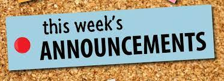

# Hello, world!

This is CS50 AP, Harvard University’s introduction to the intellectual enterprises of computer science and the art of programming for students in high school, which satisfies the [College Board’s AP Computer Science Principles](https://apcentral.collegeboard.org/courses/ap-computer-science-principles/course) (CSP) curriculum framework.

<iframe src="https://calendar.google.com/calendar/embed?height=600&wkst=1&bgcolor=%23ffffff&ctz=America%2FChicago&mode=WEEK&showNav=1&showDate=1&showPrint=1&showTabs=1&showCalendars=0&showTz=1&src=Y182bWdxdTkyN2M1c3NyanZlbGs3ZzJobjg3NEBncm91cC5jYWxlbmRhci5nb29nbGUuY29t&src=Zy5yaXNkLm9yZ18yZGdxZ2swaWs2OWFja280aXRqbTJiZ3NvOEBncm91cC5jYWxlbmRhci5nb29nbGUuY29t&src=ZW4udXNhI2hvbGlkYXlAZ3JvdXAudi5jYWxlbmRhci5nb29nbGUuY29t&color=%238E24AA&color=%23616161&color=%230B8043" style="border:solid 1px #777" width="800" height="600" frameborder="0" scrolling="no"></iframe>